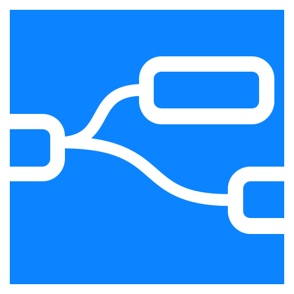

[](https://discourse.nodered.org/tag/node-red-contrib-uibuilder) 
[](https://totallyinformation.github.io/node-red-contrib-uibuilder) 
[](https://deepwiki.com/TotallyInformation/node-red-contrib-uibuilder)
[](https://github.com/sponsors/TotallyInformation)

[](https://www.npmjs.com/package/node-red-contrib-uibuilder)
[](https://www.npmjs.com/package/node-red-contrib-uibuilder)
[](https://www.npmjs.com/package/node-red-contrib-uibuilder)
[](https://github.com/TotallyInformation/node-red-contrib-uibuilder)
[](https://github.com/TotallyInformation/node-red-contrib-uibuilder/watchers)
[](https://github.com/TotallyInformation/node-red-contrib-uibuilder/stargazers)
[](https://github.com/TotallyInformation/node-red-contrib-uibuilder/blob/master/LICENSE)
[](https://www.npmjs.com/package/node-red-contrib-uibuilder)
[](http://packagequality.com/#?package=node-red-contrib-uibuilder)
[](https://deepscan.io/dashboard#view=project&tid=13157&pid=16160&bid=340901)
[](https://github.com/TotallyInformation/node-red-contrib-uibuilder/actions/workflows/codeql-analysis.yml)
[](https://github.com/TotallyInformation/node-red-contrib-uibuilder/issues)
[](https://github.com/TotallyInformation/node-red-contrib-uibuilder/issues?q=is%3Aissue+is%3Aclosed)



# UIBUILDER FOR Node-RED

> **Easy data-driven web UI's. Batteries included!**

UIBUILDER is a Node-RED add-on that makes it easy to build custom web UIs that talk to your flows (web applications). It supports no-code &amp; low-code nodes (create UI from Node-RED itself), full-code front-end templates you edit, and everything in between.

*No-code and Low-code options, driven from Node-RED* || *Dynamic data interchange Node-RED <--> browser* || *No front-end framework needed but use any of them if you want to* || *Integrate with existing web development workflows*

It includes many helper features that can reduce or eliminate the need to write code for building data-driven web applications and user interfaces integrated with Node-RED.

## Installation

UIBUILDER is best installed using Node-RED's Palette Manager.

<details><summary>Manual installs and other versions</summary>

To install manually, from a command line on your Node-RED server:

```bash
cd ~/.node-red
npm install node-red-contrib-uibuilder
```

To install old versions, provide the major version number:

```bash
cd ~/.node-red
npm install node-red-contrib-uibuilder@v5
```

To install development branches, please install from [GitHub](https://github.com/TotallyInformation/node-red-contrib-uibuilder). Branchnames are usually future version numbers, check GitHub for available branches:

```bash
cd ~/.node-red
npm install totallyinformation/node-red-contrib-uibuilder#v7.1.0
```

You will need to restart Node-RED if installing manually.
</details>

## Quickstart Guide

For a super-quick start, once installed, please see the [Getting Started](quickstart) guide.

For more guidance, check out the [First-timers walkthrough](https://totallyinformation.github.io/node-red-contrib-uibuilder/#/walkthrough1) in the documentation and the [Introduction Video](https://www.youtube.com/watch?v=IVWR_3cx05A).

Also try out the built-in example flows (via the Node-RED Import menu).

## Documentation and other links

Refer to the [Documentation web site](https://totallyinformation.github.io/node-red-contrib-uibuilder). This can also be accessed from within UIBUILDER nodes even without an Internet connection.

There is a library of "official" [video tutorials on YouTube](https://www.youtube.com/playlist?list=PL9IEADRqAal3mG3RcF0cJaaxIgFh3GdRQ). Other folk have also produced [UIBUILDER-related content](https://www.youtube.com/results?search_query=UIBUILDER+node-red).

The [Node-RED Forum](https://discourse.nodered.org/) has a dedicated [UIBUILDER tag](https://discourse.nodered.org/tag/node-red-contrib-uibuilder) for questions, discussions, ideas, support, examples and FAQ's.

You can use the [GitHub issues log](https://github.com/TotallyInformation/node-red-contrib-uibuilder/issues) for raising issues.

There is also a dedicated [Discord channel](https://discord.com/channels/980480639679725689/1416125488950411295).

## Purpose

The purpose of UIBUILDER is to:

* Support easy methods for creating and delivering data-driven web apps and web pages (also known as web User-Interfaces).
* Be a conduit between Node-RED and front-end (browser) UI web apps.
* Be UI framework agnostic. No framework is needed to use UIBUILDER but it will work with them where desired. UIBUILDER aims to reduce the requirement for a framework by making it easier to work with vanilla HTML/CSS.
* Provide interface/data standards for exchanging data and controls between Node-RED and the web pages.
* Enable the creation and management of multiple web apps from a single Node-RED instance.
* Reduce the amount of front-end code (HTML/JavaScript) needed to create and manage a web app.
* Reduce the knowledge required for creating reliable, accessible web apps by providing low-code and no-code features. But still ensure that any learning is applicable to general web development.
* Make it easy to install and serve front-end libraries to support the development of more complex web apps.

## Compatibility of current release

* Servers:
  * Node-RED: v4+
  * Node.js: v18+ LTS (matches Node-RED v4+ requirements)
  * Platforms: Linux, Windows, MacOS, Raspberry Pi, Docker, FlowFuse, etc.
* Browsers: 
  * CSS - 0.12% or above of global usage but not Internet Explorer ([ref.](https://browserslist.dev/?q=Pj0wLjEyJSwgbm90IGllID4gMA%3D%3D)). The uncompiled CSS should work in all current mainstream browsers. The compiled CSS (`uib-brand.min.css`) should work in browsers back to early 2019, possibly before. Enforced by [LightningCSS](https://lightningcss.com/).
  * JavaScript - ES6+ so should work in all current mainstream browsers. The compiled JS (`uibuilder.min.{iife|esm}.js`) should work in browsers back to early 2019, possibly before. Enforced by [ESBuild](https://esbuild.github.io/). Script (IIFE) and Module (ESM) versions are provided.

## Updates

The current [CHANGELOG](https://totallyinformation.github.io/node-red-contrib-uibuilder/#/CHANGELOG.md) contains all of the changes and requirement details for each version.

Older changes can be found in the previous change documents: [CHANGELOG-V5](https://totallyinformation.github.io/node-red-contrib-uibuilder/#/archived/CHANGELOG-v6.md), [CHANGELOG-V5](https://totallyinformation.github.io/node-red-contrib-uibuilder/#/archived/CHANGELOG-v5.md), [CHANGELOG-V3/V4]([/docs](https://totallyinformation.github.io/node-red-contrib-uibuilder/#/archived/)/CHANGELOG-v3-v4.md), [CHANGELOG-v2](https://totallyinformation.github.io/node-red-contrib-uibuilder/#/archived/CHANGELOG-v2.md), and [CHANGELOG-v2](https://totallyinformation.github.io/node-red-contrib-uibuilder/#/archived/CHANGELOG-v1.md).


### Other links

-  [UIBUILDER for Node-RED](https://github.com/TotallyInformation/node-red-contrib-uibuilder)
  - ❓ [Ideas, questions & general help](https://discourse.nodered.org/tag/node-red-contrib-uibuilder) - Ask your question on the Node-RED forum using the node-red-contrib-uibuilder tag.
  - 📁 [Documentation](https://totallyinformation.github.io/node-red-contrib-uibuilder) - Go to the latest documentation.
  - 🧑‍💻 [Flows](https://flows.nodered.org/search?term=uibuilder) - Example flows, nodes and collections related to UIBUILDER.
  - ℹ️ [WIKI](https://github.com/TotallyInformation/node-red-contrib-uibuilder/wiki) - More documentation and examples.
  - 📂 [Example Svelte External Template](https://github.com/TotallyInformation/uib-template-svelte-simple) - In case you want to build your own svelte app.
  - 📂 [Example Simple External Template](https://github.com/TotallyInformation/uib-template-test) - In case you want to build your own external template.
  - 📊 [uPlot UIBUILDER extension](https://github.com/TotallyInformation/nr-uibuilder-uplot) - Useful charts but also demonstrates how to build your own extension.

- 🧪 [Web Components Library](https://github.com/TotallyInformation/web-components) - A growing library of useful HTML Web Components. Useable with or without Node-RED & UIBUILDER. Some having specific enhancements for Node-RED but will still work well stand-alone. These now have their own dedicated documentation, demo and test website at https://wc.totallyinformation.net. Please check them out there.

- 🔨 [ui library module used by UIBUILDER](https://github.com/TotallyInformation/ui.js) - Can be used stand-alone for turning UI standard config JSON into HTML.

- 🕜 [node-red-contrib-moment](https://github.com/TotallyInformation/node-red-contrib-moment) - Nodes to make use of the MomentJS date/time handling library in Node-RED.

- 🧙 [Alternate Node-RED installer](https://github.com/TotallyInformation/alternate-node-red-installer) - Some scripts and example configs for running Node-RED locally instead of globally and having the userDir as a child folder so that everything can be easily backed up and restored from a single project folder.

- 🧪 [Testbed for Node-RED custom nodes](https://github.com/TotallyInformation/Node-RED-Testbed) - Embodying more up-to-date thinking than the test nodes, a blank playground.
- 🧪 [Test Nodes for Node-RED](https://github.com/TotallyInformation/uib-template-test) - Some test nodes for Node-RED that help you understand how everything works.

- 🚤 [HotNipi Gauge Web Component](https://github.com/TotallyInformation/gauge-hotnipi) - A really nice looking gauge component. Works with Node-RED, UIBUILDER, or stand-alone.

- 🧪 [Array Grouper](https://github.com/TotallyInformation/groupit) - Stand-alone function to reshape an array of objects.

## Contributing

If you would like to contribute to this node, you can contact Totally Information on the [Node-RED Forum](https://discourse.nodered.org/tag/node-red-contrib-uibuilder), [via GitHub](https://github.com/TotallyInformation), or [on Discord](https://discord.com/channels/980480639679725689/980480639679725693) or raise a request in the [GitHub issues log](https://github.com/TotallyInformation/node-red-contrib-uibuilder/issues).

Pull Requests both for code and documentation are welcomed and the WIKI is open to new entries and corrections (but please let me know if you make a change).

Please refer to the [contributing guidelines](https://github.com/TotallyInformation/node-red-contrib-uibuilder/blob/master/.github/CONTRIBUTING.md) for more information.

You can also support the development of UIBUILDER by sponsoring the development.

[](https://ko-fi.com/A0A3PPMRJ)

[GitHub Sponsorship](https://github.com/sponsors/TotallyInformation), 
[PayPal Sponsorship](https://paypal.me/TotallyInformation),
[Patreon Sponsorship](https://patreon.com/TotallyInformation?utm_medium=github&utm_source=join_link&utm_campaign=creatorshare_creator&utm_content=copyLink)

## Sponsors

- [@MagicJF](https://github.com/MagicJF)

## Developers/Contributors

- [Julian Knight](https://github.com/TotallyInformation) - the designer and main author.
- [Colin Law](https://github.com/colinl) - many thanks for testing, corrections and pull requests.
- [Steve Rickus](https://github.com/shrickus) - many thanks for testing, corrections, contributed code and design ideas.
- [Ellie Lee](https://github.com/ellieejlee) - many thanks for the PR fixing duplicate msgs.
- [Thomas Wagner](https://github.com/Thomseeen) - thanks for the steer and PR on using projects folder if active.
- [Arlena Derksen](https://github.com/boisei0) - thanks for suggestions, bug checks and Issue #59/PR #60.
- [cflurin](https://discourse.nodered.org/u/cflurin) - thanks for the cache example.
- [Scott Page - IndySoft](https://github.com/scottpageindysoft) - thanks for Issue #73/PR #74.
- [Stephen McLaughlin - Steve-Mcl](https://discourse.nodered.org/u/Steve-Mcl) - thanks for the fix for [Issue #71](https://github.com/TotallyInformation/node-red-contrib-uibuilder/issues/71) and for the enhancement idea [Issue #102](https://github.com/TotallyInformation/node-red-contrib-uibuilder/issues/102).
- [Sergio Rius](https://github.com/SergioRius) - thanks for reporting [Issue #121](https://github.com/TotallyInformation/node-red-contrib-uibuilder/issues/121) and providing [PR #122](https://github.com/TotallyInformation/node-red-contrib-uibuilder/pull/122) as a fix.
- [Thorsten von Eicken](https://github.com/tve) - thanks for providing [PR #131](https://github.com/TotallyInformation/node-red-contrib-uibuilder/pull/131) to improve CORS handling for Socket.IO.
- [meeki007](https://github.com/meeki007) - thanks for supplying various documentation improvements and code fixes.
- [Scott - talltechdude](https://github.com/talltechdude) - thanks for supplying PR #170.
- [Calum Knott](https://github.com/calumk) - Thanks for the tidied up node-blue logo.
- [Harold Peters Inskipp](https://github.com/HaroldPetersInskipp) - Thanks for the logging examples.
- [dczysz](https://github.com/dczysz) - Thanks for reporting [Issue #186](https://github.com/TotallyInformation/node-red-contrib-uibuilder/issues/186) and helping work through the complex async bug.
- [Colin J (mudwalkercj)](https://github.com/mudwalkercj) - Thanks for helping with the documentation.
- [Marcus Davies](https://discourse.nodered.org/u/marcus-j-davies) - Many thanks for the encouragement and for the 3d logo.
- [Fabio Marzocca (fmarzocca)](https://discourse.nodered.org/u/fmarzocca)) - Many thanks for help with the design and testing of the uibrouter front-end router library.
- [MysteryCode (mutec)](https://github.com/mutec)) - Thanks for the PR to fix up the standardised use of fast-glob for returning lists of files.

Many other people have contributed ideas and suggestions, thanks to everyone who does, they are most welcome.

<a href="https://stackexchange.com/users/1375993/julian-knight"></a>

Please also check out my blogs:

* [Totally Information's Web Log](https://www.totallyinformation.net), "Ramblings by Julian Knight on all things Digital, Technology and Life". This is my new blog. It will have articles on Node-RED, web development, hardware reviews and more.
* [Much Ado About IT](https://it.knightnet.org.uk), it has information about all sorts of topics, mainly IT related, including Node-RED. This is no longer being updated but it will be retained for reference.
