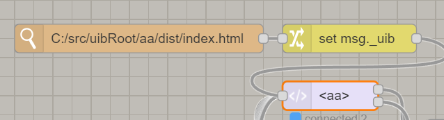

## Reload message

The UIBUILDER front-end library has a a reload window tab command built in. This can be triggered by sending a standard message into a node-red node with the following data:

```json
{
    "_uib_": {
        "reload": true
    }
}
```

You can use a `watch` node to trigger a reload by watching the appropriate file or folder and connecting the watch node to a change node that sets the _uib.payload property and then sends it to the `uibuilder` node as in this example:



## Editing files in the Node-RED Editor

UIBUILDER has a file editor feature built in. If you are using that (only recommended for fairly small edits), you can tell UIBUILDER to automatically reload the browser tab whenever you press the save button.

## Using Microsoft Edge developer tools with VScode

Microsoft Edge has an experimental settings as part of its DevTools. This works when you are running Node-RED on the same device as the browser.

Find "Open source files in Visual Studio Code" under Settings > Experiments. Turn it on and restart the tools window.

Then you will need to close and reopen the page you want to edit and tell Edge to trust DevTools access to the filing system.

Finally, you will need to make sure that you have the correct folders added under Settings > Workspace. You will probably need to add your uibRoot folder. You may need to close and reopen the page again.

After that, DevTools should indicate when it has matched a served file with one on the filing system. Those files can be edited in either DevTools _or_ VScode. On save, the browser page automatically updates. This works for CSS and JavaScript files.

Use the watch approach above for HTML files.

## Web development build tools

Most build tools contain their own development server that includes auto-update.

To use these with UIBUILDER, you generally have to make some code changes in your index.html and index.js files to allow for the fact that a different, non-Node-RED web server is presenting the files.

You will need to pass some parameters to the `uibuilder.start` function in index.js and will need to make the `./` and `../uibuilder/vendor/` URL's in index.html absolute to include the Node-RED URL.

It is perfectly OK to leave those changes in for production use. However, note that you will need to make further changes if you put your Node-RED/uibuilder server behind a proxy or change its port number. Or change any of the Node-RED settings that impact the URL.

If you are using Svelte and its development tools, they are the exception to this rule as the dev-server manages to auto-update the standard page.

## Running Node-RED from a development service

Tools such as PM2 for running Node.js applications have watch features built in.

This is really only useful for developing custom nodes as the service will restart Node-RED on changes.
