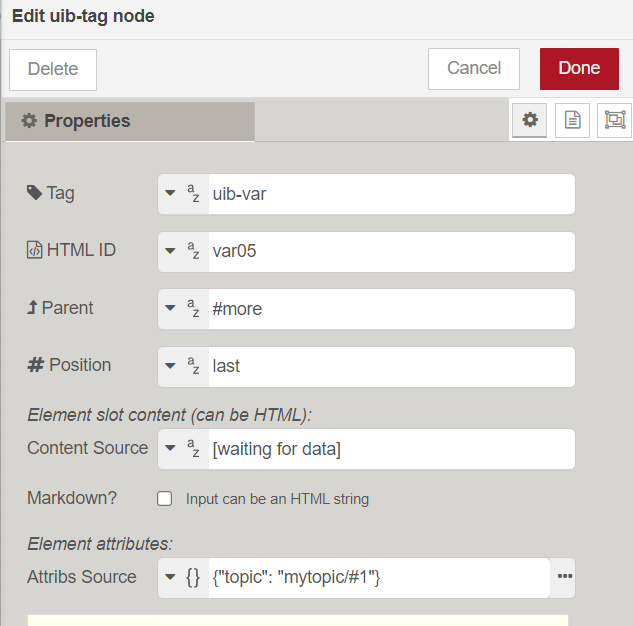

UIBUILDER can work with front-end frameworks such as REACT, VueJS, etc. However, it does not need them. But one thing that these frameworks often have are collections of components that you can add to your HTML. Each component will produce something useful in your web page such as an information card, tabbed interface, navigation menu, etc.

For more modern browsers though, there is an alternative to a framework and that is "[web components](https://developer.mozilla.org/en-US/docs/Web/API/Web_Components)". These are a W3C international standard and they are defined using JavaScript.

The [`uib-var`](#uib-var-include-a-managed-variable-in-the-page) built-in component is an example of such a component.

To make use of a web component, all that is needed is to load it. Web components are written as ES Modules (ESM). In this form, you can only use them with the ESM version of the uibuilder client library and they will need loading as an `import` statement in your module `index.js` just like the client library itself. (`uib-var` is loaded for you, you don't have to do anything).

However, some components may also be built so that they can be loaded as a linked script. This is easily done using a build tool such as [`esbuild`](https://esbuild.github.io/). When built this way, they can be used with the standard IIFE version of the uibuilder client library. A well-crafted component will often include a version for loading this way but it is up to the author to make this available. Check the component's documentation for details.

> [!NOTE]
> UIBUILDER's no-code `uib-element` node currently sends out low-code JSON data that describes each element. While this is reasonably efficient since no actual HTML/JavaScript code is sent, it could be even more efficient by having a corresponding web component for each element. This is something that is likely to happen in a future release.

## Built-in components: `uib-var` - include easily updated output in the page :id=uib-var

This component provides another way to make it easy to include dynamic data in your web UI and to update it. It is roughly equivalent to the "mustache" style brackets found in many front-end frameworks (<code>&#123;{myvariable}}</code>). However, unlike those, it is 100% standard HTML. The component reference is replaced in the web page by a uibuilder managed variable value, msg topic payload, or the returned value of a filter function - depending on the attributes provided.

Included in your page using the `<uib-var>`, see the examples below on how to include this in your HTML. You can also use the no-code `uib-tag` node to add it to your HTML. 

There is no need to separately load the component, that is done automatically by the uibuilder client library.


### Attributes

These attributes can be added to the `<uib-var>` tag. Noting that attributes must always have _string_ values, e.g. `topic="my/topic/#1"`.

#### `topic` :id=topic

Adds a background "listener" for messages from Node-RED via UIBUILDER that have the `topic` property matching this attribute. For example, the HTML `<uib-var topic="my/topic/#1"></uib-var>` will be automatically updated to show `42` when the corresponding uibuilder node is sent a message containing `{topic: 'my/topic/#1', payload: 42}`.

This is the easiest way to use the `uib-var` component with UIBUILDER.

This approach is especially useful to be able to display MQTT topic values in your UI

> Cannot be used in conjunction with the `variable` attribute.

#### `variable` :id=variable

Displays the *value* of the given variable name in your web page and *dynamically updates* as long as the variable is changed using `uibuilder.set()`; or from Node-RED using the appropriate uib set command, e.g. `msg = {"command":"set","prop":"myVar","value":"42"}`. By default, the tag inserts the variable value inline with other text. Class and Style attributes can be added as for any other HTML.

> Cannot be used in conjunction with the `topic` attribute.

#### `filter` :id=filter

Takes a string representation of a function to run before display. It can be used on its own or in conjunction with either the `variable` or `topic` attributes.

When used with the `variable` or `topic` attributes, the function will be passed the corresponding value as its first parameter. Any additional parameters provided on this attribute will be merged _after_ the value.

The function must be accessible from the global `window` environment and return valid text or HTML which will be used as the displayed content.

The attribute string may include simple arguments only (e.g. strings, booleans and numbers - `filter="myfunc('text', 42, true)"`).

Dotted notation for the function name is allowed (e.g. `uibuilder.get('version')`) but the array style (e.g. `uibuilder['get']('version')`) is not permitted.

If the function name is not found in the global window context, the `uibuilder` context is searched so `get('version')` will call `uibuilder.get('version')` so long as `get` is not defined as `window.get` which would take preference.

Generally, it will be best to define your own function. Further standard filters may be added in future releases of UIBUILDER. Until then, a list of standard filters included in the uibuilder is provided [lower-down](#useful-filter-functions).

> [!NOTE]
> If having problems getting your filter functions recognised, try adding them earlier in the HTML.
>
> Notably, **before** the uibuilder client library is loaded.
> 
> For example, defining the `lang` filter:
> ```html
  <!-- #region Supporting Scripts. These MUST be in the right order. Note no leading / -->
  <script>
    // Some filter functions
    globalThis.lang = () => navigator.language
    globalThis.yen = (v) => uibuilder.formatNumber( v, 2, 'ja-JP', { style: 'currency', currency: 'JPY' } )
  </script>
  <script defer src="../uibuilder/uibuilder.iife.min.js"></script>
  <script defer src="./index.js"></script>
  <!-- #endregion -->
> ```

#### `undefined` :id=undefined

If present or set to `on`, or `true`, the component will show even if the variable is undefined. 
  
If not present or set to anything else, an undefined variable will show the _slot content_ (anything put between the open and close tag). This lets you have an initial value showing that is replaced as soon as the variable is actually set.

#### `report` :id=report

If present or set to `on`, or `true`, the component will return a standard message back to Node-RED when the variable changes value.

#### `type` :id=type

Must be one of 'plain', 'html', 'markdown', or 'object'. `plain` and `html` simply insert the variable as-is. `markdown` allows the insertion of Markdown as long as the Markdown-IT library is loaded (it will also sanitise the resulting HTML if the DOMPurify library is loaded). `object` does some basic formatting to allow object or array variables to be more easily read.


This works with Markdown via the `uib-element` node as well and even works if DOMPurify is loaded as overrides to its filters are provided.


### Styling

The component tries to load `./index.css` as a stylesheet so that your own styling can be used in any output.

Simply ensure that the file is served from the same URL location as your main page.

This is the standard method for UIBUILDER instances but this feature is not dependent on UIBUILDER.

### Useful filter functions

#### `uibuilder.formatNumber` :id=format-number

Formats a number to a given locale and optionally, a set number of decimal places.

Example, formatting to 2dp using the Japanese locale: `<uib-var topic="mynumber" filter="uibuilder.formatNumber(2, 'ja-JP')"></uib-var>`.

Note that the value is passed automatically so the first provided argument is the number of decimal places.

Parameters: `formatNumber(value, decimalPlaces, intl, opts)`. Where `opts` is an INTL formatting object.

See details in the [client functions doc](client-docs/functions#formatNumber).

### Examples

```html
<p>
    UIBUILDER client library version 
    "<uib-var variable="version"></uib-var>".
</p>
```

```html
<p>Last msg received: "<uib-var variable="sentMsg" type="object"></uib-var>".</p>
```

```html
<!-- Shows the value even if undefined. Sends a msg to Node-RED when myVar is changed -->
<p>The answer is <code><uib-var variable="myVar" undefined report></uib-var></code>.</p>
```

```markdown
## My Heading

The version of the uibuilder client library currently 
loaded is `<uib-var variable="version"></uib-var>`.
```

#### Adding a tag to your page using no-code from Node-RED

Use a `uib-tag` node:



## External components

Web components can be challenging to build but are often fairly simple. There are plenty of web resources to get you started with development of them. However, there are also a lot of existing components that you can easily make use of with Node-RED and UIBUILDER.

Such components can be manually added to your `index.html` file OR they can be dynamically added using UIBUILDER's no-code `uib-tag` node.

Some potentially useful components are shown below.

### Totally Information experimental web components

Totally Information has a (so far experimental) set of web components that work with or without UIBUILDER though they will generally have extra features when used with. See the [TotallyInformation/web-components GitHub repo](https://github.com/TotallyInformation/web-components) for details. 

### HotNiPi Gauge component

A nice looking gauge was gifted to the community by Node-RED forum contributor HotNiPi and this also works with or without UIBUILDER. See [HotNipi Gauge Web Component](https://github.com/TotallyInformation/gauge-hotnipi) for details. In line with UIBUILDER standards, the gauge component is available in both ESM and IIFE formats for ease of use.

### Other components and libraries

There are many web components and web component libraries available. All should work with UIBUILDER.

- [Basic Material Design components](https://material-web.dev/about/intro/) - supported by Google designers and developers.
- [Elix components](https://component.kitchen/elix) - high-quality basic elements and composable mixins.
- [Webcomponents.org](https://www.webcomponents.org/) - elements, collections and how-to's.
- [Webcomponents.org libraries](https://www.webcomponents.org/libraries)
- [GitHub Components](https://github.com/orgs/github/repositories?q=component) - various components and tools written by GitHub devs.
- [Mozilla Developer Network (MDN) example components](https://github.com/mdn/web-components-examples) - example components, useful to get started on your own.
- [Open Web Components](https://open-wc.org/) - guides, tools and libraries for developing web components.
- [Open Web Components community libraries](https://open-wc.org/guides/community/component-libraries/) - list of potentially useful component libraries.
- "Awesome" lists
  - [obetomuniz/awesome-webcomponents](https://github.com/obetomuniz/awesome-webcomponents/blob/master/README.md)
  - [web-padawan/awesome-web-components](https://github.com/web-padawan/awesome-web-components/blob/main/README.md)

