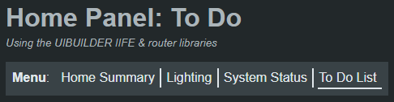

The `uibrouter` front-end library defines a `UibRouter` class. This allows both internal and external content to be dynamically shown, allowing the creation of "Single-Page Apps" (SPA's) or simply keeping parts of the UI hidden from the users until they need them.

Internal route content is defined in `<template>` tags in your HTML. Each must have an `id` attribute that matches the route id specified in the router config.

External route content is defined in additional HTML files in the same location as your index.html/index.js (or in a convenient sub-folder as desired) so that they are served up by Node-RED/uibuilder as per your other front-end web assets.


## Creating a front-end router

Add the router library url to a script link in your HTML file. Add it after after the uibuilder library if using with UIBUILDER.

Create a new router instance in code - see the Example at the end of the page.

Create internal and external route templates as needed and define in the router config.

The router class library is available in the uibuilder front-end resources in several formats. However, it is not dependent on UIBUILDER and can be extracted and used elsewhere as desired noting the license and copyright information embedded in the source.

The easiest way to include the router is to use the `../uibuilder/utils/uibrouter.iife.min.js` version in a script link in your HTML. This loads the `UibRouter` class as a global reference. If, however, you are loading your scripts as ES Modules, you should use `../uibuilder/utils/uibrouter.esm.min.js` in your import. Both versions have `.map` files which makes debugging easier.

## Triggering a route change

### From Node-RED

Route changes can be triggered from Node-RED flows by sending a message to the uibuilder node with msg content such as:

```json
{"_uib": {"command":"navigate","prop":"#newroute"}}
```

See [Client Functions (navigate)](client-docs/functions#navigate) for details.

Don't forget that there is also a `watchUrlHash` function, also callable as a command. That will send a message to Node-RED on every route change.

### In the browser

There are three ways to trigger a route change:

* Manually changing the URL, adding `#routeid`
* Link tags with a hash url only, `<a href="#routeid">`
* Javascript using `router.doRoute('routeid')`

Here is an example of a very simplistic menu that uses URL links:

```html
<ul id="routemenu">Route Menu
    <li><a href="#route01">#1 (Internal template)</a></li>
    <li><a href="#route02">#2 (Internal template)</a></li>
    <li><a href="#route03?doh=rei">#3 (External template)</a></li>
    <li><a href="#route04">#4 (fails as the external route template doesn't exist)</a></li>
</ul>
```

And an example of triggering a route change in code:

```javascript
router.doRoute('route02')
```

Or even from a click event on a random HTML element:

```html
<div href="#route01" onclick="router.doRoute(event)">Go to route #1 via click event handler.</div>
```

## Operational modes

The router can act in one of two ways.

The default mode deletes a route's HTML when a route change occurs and duplicates the route template into the route container.

The hide/show alternate mode, only duplicates the route template once, on first access. Subsequent route changes just set the route container to CSS `display: none` before either duplicating a new template into place or removing (unhiding) the `display: none` if that route had previously been selected.

| Mode      | Advantages                                                   | Disadvantages                                                |
| --------- | ------------------------------------------------------------ | ------------------------------------------------------------ |
| Clone     | Keeps `<body>` code as simple as possible.<br /><br />The visible clone is reset back to the template on every access. | Any `script` tags are re-executed. So requires code that should not be re-executed (such as code that creates global variables or functions) to be wrapped with a flag che |
| Hide/Show | `script` tags in routes are only executed once.<br /><br />Templates can be unloaded after use. | `script`s cannot be run multiple times, define a function can call that instead.<br /><br />The visible clone cannot be reset back to the default. Once accessed, the template is never used again.<br /><br />Clutters up `body` code, potentially keeps duplicate code in memory (the template and the visible clone) unless you forcibly unload the template after access. |

Which mode you use will be dependent on what you want to achieve.

## Configuration

TBC - See the example below for configuration settings.

### Configuration Schema

```js
/** Type definitions
 * 
 * routeDefinition - configuration for each route
 * @typedef {object} routeDefinition Single route configuration
 * @property {string} id REQUIRED. Route ID
 * @property {string} src REQUIRED. CSS Selector for template tag routes, url for external routes
 * @property {"url"|undefined} [type] OPTIONAL. "url" for external routes
 * @property {string} [title] OPTIONAL. Text to use as a short title for the route
 * @property {string} [description] OPTIONAL. Text to use as a long description for the route
 * 
 * UibRouterConfig - main configuration
 * @typedef {object} UibRouterConfig Configuration for the UiBRouter class instances
 * @property {routeDefinition[]} routes REQUIRED. Array of route definitions
 * @property {string} [defaultRoute] OPTIONAL. If set to a route id, that route will be automatically shown on load
 * @property {string} [routeContainer] OPTIONAL. CSS Selector for an HTML Element containing routes
 * @property {boolean} [hide] OPTIONAL. If TRUE, routes will be hidden/shown on change instead of removed/added
 * @property {boolean} [unload] OPTIONAL. If TRUE, route templates will be unloaded from DOM after access. Only useful with the `hide` option
 * 
 */
```

## Defining route templates

Internal route templates are simply valid HTML wrapped in a `<template>` tag. They may contain `<style>` and `<script>` tags if needed though note the potential issues listed below. Internal templates can go into the `<head>` section of your HTML if you want to keep the `<body>` clear. Template tags are standard HTML and are not loaded into the DOM.

External route templates are simply HTML files with the same format as the internal route templates shown (without the `<template>` tags). They should be HTML document fragments and so should not have `<!doctype html>`, `<html>`, `<head>`, or `<body>` tags. The router will automatically load the templates on startup. The external templates are loaded to the end of the `<head>` section of the page HTML.

## Defining navigation menus

There are many different ways to define navigation menus in HTML, too many to provide a function that would generate them automatically.

### Manual menu definitions

To enable the router library to mark the current route in a menu, all you need to do is to use an HTML list where list items are marked with `<li data-route="routeid">`. Wherever `routeid` matches the new current route, the router will automatically add attributes `<li data-route="routeid" class="currentRoute" aria-current="page">`. Removing them from all other `li` tags having a `data-route` attribute.

This means that you can have multiple menu's on-page and each can be styled differently.

#### Example

```html
<header>
    <h1 class="with-subtitle">Home Panel: <uib-var variable="uibrouter_CurrentTitle"></uib-var></h1>
    <div role="doc-subtitle">Using the UIBUILDER IIFE &amp; router libraries</div>
    
    <nav id="main-menu" class="horizontal" aria-labelledby="primary-navigation">
        <h2 id="primary-navigation">Menu</h2>:
        <ul id="routemenu" role="menubar" aria-describedby="main-menu">
            <li data-route="route01" tabindex="0" role="menuitem"><a href="#route01">Home Summary</a></li>
            <li data-route="lights" tabindex="0" role="menuitem"><a href="#lights">Lighting</a></li>
            <li data-route="status01" tabindex="0" role="menuitem"><a href="#status01">System Status</a></li>
            <li data-route="wanted" tabindex="0" role="menuitem"><a href="#wanted">To Do List</a></li>
        </ul>
    </nav>
</header>
```



### Automating menus

If you wish to automatically generate menus, you can use the `routeList()` method of the router. You can use this in JavaScript to generate appropriate lists.

## Events

These are the custom `document` events used by the router class. Listen for them using `document.addEventListener('eventname', callbackFn)`. The callback function may receive additional data as an argument where shown below.

* `uibrouter:loaded` - When all internal and external routes have loaded.
* `uibrouter:route-changed` - when a route change is successful. Details contain new and old route id's.
* `uibrouter:route-change-failed` - when a route change fails and is rolled back. Details contain new and old route id's.
* `uibrouter:routes-added` - When new routes added (via `router.addRoutes()`).

Note that, when used with UIBUILDER, several managed uibuilder variables are also set - see the [section on UIBUILDER below](#using-with-uibuilder). These generate their own events that can be monitored via `uibuilder.onChange` (in JavaScript) or via `<uib-var variable="...."></uib-var>` (in HTML).

## Variables

* `config` - A copy of the input configuration used to create the router.
* `currentRouteId` - The route id of the currently showing route.
* `previousRouteId` - The route if of the previously showing route.
* `routeContainerEl` - A reference to the DOM (HTML) element containing the displayed route(s)
* `routeIds` - An array of route IDs
* `version` - The version of the router class being used

Note that, when used with UIBUILDER, several managed uibuilder variables are also set - see the [section on UIBUILDER below](#using-with-uibuilder).

## Methods

* `addRoutes(routeConfig)` - Add a single or an array of route config objects which adds new routes to the router.
  
  External routes will be loaded to template tags as per class startup. Note that external templates are loaded asynchronously. Check for the `uibrouter:routes-added` custom event to have fired or listen for the uibuilder `uibrouter` managed variable to be set to `routes added` to detect when all new external routes have been loaded.

* `currentRoute()` - Returns the configuration data `{id, src, type, title, description}` of the current route as a JavaScript object.
* `defaultRoute()` - Show the default route if it has been defined in the config.
* `doRoute(routeSource)` - Manually show a specific route id.
* `getRouteConfigById(routeId)` - Gets route configuration details for a given route id.
* `isRouteExternal(routeId)` - Returns true if the given route id is an external route.
* `keepHashFromUrl(url)` - Given a URL, extracts and returns a route id.
* `loadExternal(routeDefinition)` - Loads an external route template given a valid route definition.
* `noRoute()` - Removes/hides the current route leaving no route showing. NOTE that this will ***NOT*** trigger *route or hash change events*.
* `removeHash()` - Removes the hash from the browser URL.
* `routeDescription` - Returns the description of the current route or its ID if the `description` property not set.
* `routeList(returnHash)` - Return an array of route id's. Useful for creating routing menu's. If the optional `returnHash` is set to true, returns id's prefixed with a `#` for direct use in `href` attributes.
* `routeTitle` - Returns the title of the current route or its ID if the `title` property not set.
* `setCurrentMenuItems()` - Updates any on-page menu's so that the currently selected route can be highlighted. Adds `class="currentRoute" aria-current="page"` to the current route item in the list and removes them from all other items. Assumes that you are using an HTML list where the list items are marked with `<li data-route="routeid"`. Wherever `routeid` matches the new current route, the above attributes are added.

> [!NOTE]
> Any class methods starting with `_` are for internal use only and must not be used in your own code.

## Errors

TBC

## Including styles and scripts in route content

TBC

### Notes

* If using the router's "Clone" mode (default), remember that scripts in the template are _run every time the route is activated_. So make sure to put a gate test in the script if you want it to only run once.
* You can reference elements added in the template from the script in the template (the addEventListener for example).
* Because of the way that scripts from the external templates have to be applied, any code is global to the page. Bear that in mind as it is likely different to some frameworks. Similarly with styles.
* A script defined in an external template is run EVERY time the route is loaded. Bear this in mind when adding things like uibuilder.onChange handlers, as these accumulate rather than replace.
* In HTML, scripts are not really meant to be dynamically added/removed so use scripts embedded in external route files with caution.

* Styles defined in the template are globally available. However, in "Clone" mode, they will not exist until the route as been activated at least once.
* Remember that styles in external templates only exist while that route is loaded. While you can reference that style anywhere on page, it will only apply when the route is loaded. This could be used to get some interesting effects such as having page styles change outside the route display based on the current route (though it would require the route to be unloaded when not in use).


## Using with UIBUILDER

While not dependent on UIBUILDER, the router class does work nicely with it.

### Monitoring for route changes

#### In front-end HTML

As the router will generate managed variable updates (see below), you can use the `<uib-var>` component in your HTML. The content will automatically update as things change.

```html
Current route ID: <uib-var variable="uibrouter_CurrentRoute"></uib-var>.
Route title: <uib-var variable="uibrouter_CurrentTitle"></uib-var>.
Route description: <uib-var variable="uibrouter_CurrentDescription"></uib-var>.
```

Note that the title and description are optional properties, where not present, the route ID will be shown instead.

#### In front-end JavaScript code

You can either use the uibuilder managed variables and `uibuilder.onChange` or the custom events (see the [events](#events) section above) with a JavaScript event handler.

```javascript
// Assumes use of uibuilder and assumes `const router = new uibrouter(config)`
uibuilder.onChange('uibrouter', (eventname) => {
    if (eventname === 'route changed') {
        // Uses 2 of the router variables - see below for the full list
        console.log(`ROUTE CHANGED. New Route: ${router.currentRouteId}, Old Route: ${router.previousRouteId}`)
    }
})
// OR
uibuilder.onChange('uibrouter_CurrentRoute', (routeId) => {
    console.log(`ROUTE CHANGED. New Route: ${routeId}`)
})
```


#### In Node-RED

The simplest way to report route changes back to Node-RED is to use uibuilder's `watchUrlHash()` function or monitor changes on the managed variable `urlHash`.

The `watchUrlHash()` function will send a message back to Node-RED with the following format:

```json
{
    "topic": "hashChange",
    "payload": "#route02",
    "newHash": "#route02",
    "oldHash": "#route01",
    "_socketId": "sXQLk3yJw-8AkMg6AAH6",
    // "_uib": { ... }, // Shown if `Include msg._uib in standard msg output.` turned on in uibuilder node
    "_msgid": "7304ef8d00bee8b4"
}
```

You will probably want the "Include msg._uib in standard msg output" flag turned on in the uibuilder node so that you can know which client id and page the notification came from.

This feature can be turned on in your front-end code with `uibuilder.watchUrlHash()` or from Node-RED by sending a uibuilder command message with `msg._ui` set to `{"command": "watchUrlHash"}` (which toggles the watch on/off). See [Control from Node-RED](client-docs/control-from-node-red#watchurlhash-watch-for-url-hash-changes) in the docs for more details.

### Managed variables

The router also sets some uibuilder managed variables:

* `uibrouter`: Set to `loaded`, `route changed`, `route change failed`, or `routes added` at appropriate times.
* `uibrouter_CurrentRoute`: The ID of the current route.
* `uibrouter_CurrentTitle`: The route title. Will show the ID if the route's `title` property not set.
* `uibrouter_CurrentDescription`: The route description. Will show the ID if the route's `description` property not set.
* `uibrouter_CurrentDetails`: The route configuration object for the current route.

Managed uibuilder variables can be monitored via `uibuilder.onChange` (in JavaScript) or via `<uib-var variable="...."></uib-var>` (in [HTML](#in-front-end-html)).


## Other Notes

* Your routes can be a mix of external files and `<template>` tags.
* An incorrect URL for an external template will give a console error but everything else will still work.
* You can define a container that the output route goes into but if you don't give your own, one is added. 
* If you give a route container id that doesn't actually exist, a div will be created for you at the end of the body.
* Manually added templates can go anywhere in the HTML but I put them in the `<head>` out of the way. External templates are added to the end of the head.
* The exact order of the templates in the HTML is not guaranteed because they are all loaded in parallel. This should not matter.
* The external templates are ALL loaded into the page when the router is set up. This wouldn't normally cause any issues but if you had many dozens of really big templates, you might get some memory issues.
* A script defined in an external template is run EVERY time the route is loaded. Bear this in mind when adding things like `uibuilder.onChange` handlers, as these accumulate rather than replace.
* Any change of route is entirely up to you. You can use a menu, "tabs" or anything else to control route changes. You can do them from code with `router.doRoute('routeid')` as well. You just need to ensure that the element that triggers the change has an href that matches a route. It is best and safest to always use `<a href="#routeid">` tags because they also trigger the browser's URL Hash change processing. UIBUILDER has functions for monitoring that should you need them, or you can add your own event listener.

## Example

```javascript
const routerConfig = {
    // OPTIONAL. Router templates created inside the routeContainer, specify an CSS selector
    // If not provided, default div with ID uibroutecontainer is added as the last element of the body
    routeContainer: '#routecontainer',

    // OPTIONAL. Chose a default route id to be displayed on load
    defaultRoute: 'route03',

    // OPTIONAL. If true, use CSS show/hide instead of removing/recreating route content
    // hide: true,

    // OPTIONAL. If true, templates are unloaded from the DOM after being accessed (only useful with hide: true)
    // unload: true,

    // REQUIRED. Define the possible routes type=url for externals
    // Can be an object or an array but each entry must be an object containing {id,src,type}
    //   type can be anything but only `url` will be treated as an external template file.
    //   src is either a CSS selector for a <template> or a URL of an HTML file.
    //   id must match the href="#routeid" in any menu/link. and `<template id="routeid">` on any loaded template
    //      must be unique on the page
    routes: [
        // Two <template> tags as routes
        { id: 'route01', src: '#route01',
          title: 'Home', description: 'A summary view of the home.' },
        {id: 'route02', src: '#route02'},
        // File exists in sub-folder below index.js, is served by Node-RED/uibuilder
        {id: 'route03', src: './fe-routes/route03.html', type: 'url'},
        // Doesn't exist. Tests load error
        {id: 'route04', src: './fe-routes/dummy.html', type: 'url'},
    ],
}
const router = new UibRouter(routerConfig)
```

With a simple HTML Menu:

```html
<ul id="routemenu">Route Menu
    <li><a href="#route01">#1 (Internal template)</a></li>
    <li><a href="#route02">#2 (Internal template)</a></li>
    <li><a href="#route03?doh=rei">#3 (External template)</a></li>
    <li><a href="#route04">#4 (fails as the external route template doesn't exist)</a></li>
</ul>
```

To load the library when using with UIBUILDER (based on the "Blank" uibuilder template):

```html
<!doctype html>
<html lang="en"><head>

    <meta charset="utf-8">
    <meta name="viewport" content="width=device-width, initial-scale=1">
    <link rel="icon" href="../uibuilder/images/node-blue.ico">

    <title>Blank template - Node-RED uibuilder</title>
    <meta name="description" content="Node-RED uibuilder - Blank template">

    <!-- Your own CSS (defaults to loading uibuilders css)-->
    <link type="text/css" rel="stylesheet" href="./index.css" media="all">

    <!-- #region Supporting Scripts. These MUST be in the right order. Note no leading / -->
    <script defer src="../uibuilder/uibuilder.iife.min.js"></script>
    <script defer src="../uibuilder/utils/uibrouter.iife.min.js"></script>
    <script defer src="./index.js"></script>
    <!-- #endregion -->

    <template id="route01">
        <h2>This comes from an internal <code class="r01style">&lt;template></code> tag</h2>
        <div>
            Route 1
        </div>
        <script>
            console.log('I was produced by a script in Route 1')
        </script>
        <style>
            .r01style {
                background-color: yellow;
                color: blue;
                font-weight: 900;
            }
        </style>
    </template>
    <template id="route02">
        <h2>This also comes from an internal <code>&lt;template></code> tag</h2>
        <div class="extraclass">
            Route 2
        </div>
    </template>

</head><body class="uib">

    <h1 class="with-subtitle">A simple front-end router example</h1>
    <div role="doc-subtitle">Using the uibuilder and uibrouter IIFE libraries.</div>

    <div id="more"><!-- '#more' is used as a parent for dynamic HTML content in examples --></div>

    <ul id="routemenu">Route Menu
        <li><a href="#route01">#1 (Internal template)</a></li>
        <li><a href="#route02">#2 (Internal template)</a></li>
        <li><a href="#route03?doh=rei">#3 (External template)</a></li>
        <li><a href="#route04">#4 (fails as the external route template doesn't exist)</a></li>
    </ul>

</body></html>
```
