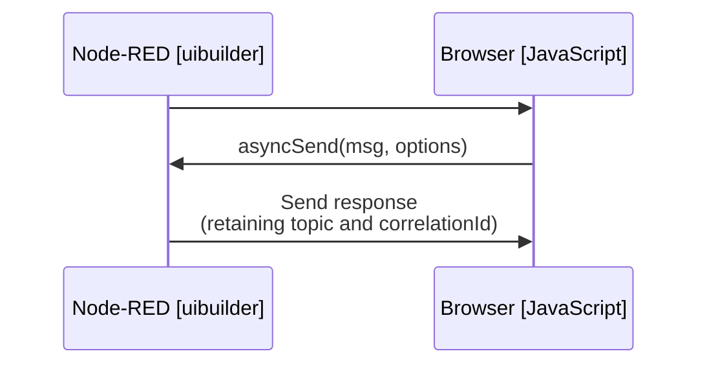

* **Sends a message to Node-RED** with a unique correlation ID (`msg._uib.correlationId`) and the specified topic (`msg.topic`).
* **Returns a Promise** that resolves when a matching response is received.
* **Matching logic**: The response must have the same `msg.topic` AND `msg._uib.correlationId`.
* **Timeout option**: Defaults to 60 seconds (60000ms), configurable via `options.timeout`.
* **onSuccess callback**: Optional function called on successful response.
* **Originator support**: Optional Node-RED node ID to return the message to (when used with `uib-sender` node).

#### Usage Examples

```javascript
// Basic usage - await the response
const responseMsg = await uibuilder.asyncSend({ topic: 'myTopic', payload: 'Hello' })

// With options
const responseMsg = await uibuilder.asyncSend(
    // msg to send
    { topic: 'getData', payload: { id: 123 } },
    // options
    { timeout: 30000, onSuccess: (msg) => console.log('Got response:', msg) }
)

// Using .then()
uibuilder.asyncSend({ topic: 'query', payload: 'test' })
    .then(response => console.log('Response:', response))
    .catch(err => console.error('Failed:', err))
```

#### Node-RED Side

For this to work, your Node-RED flow *must* echo back the `msg._uib.correlationId` _and_ the `msg.topic` in the response message.

The flow pattern would be:


