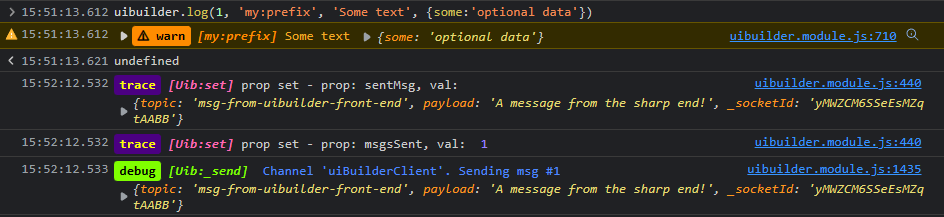

Functions accessible in client-side user code.

- [Receiving Messages from Node-RED](#receiving-messages-from-node-red)
- [Sending Messages to Node-RED](#sending-messages-to-node-red)
- [Variable Handling](#variable-handling)
- [UI Handling](#ui-handling)
- [HTML/DOM Cacheing](#htmldom-cacheing)
- [Event Handling](#event-handling)
- [Utility](#utility)
- [Startup](#startup)


## Receiving Messages from Node-RED

uibuilder automatically creates a live websocket channel from the Node-RED server to your browser when you open a uibuilder page. By sending a msg to a uibuilder node, it will be transferred to ALL connected clients unless you specify otherwise.

To process a message in your browser, you can use one of the event handling uibuilder library functions such as [`onChange`](#event-handling) or [`onTopic`](#event-handling). Alternatively, you can use the standard `document.addEventListener` function to listen for one of the uibuilder library's custom events.

You can also do `uibuilder.set('msg', {/*your object details*/})` in your front-end code which instructs the client to treat the object as though it had come from Node-RED.

You can use one or more of the `msg._uib.pageName`, `msg._uib.clientId`, or `msg._uib.tabId` properties to control whether a specific page, client or browser tab will process an inbound message. Use this where you have multiple pages or clients and need to target a message to a specific one.

## Sending Messages to Node-RED

### `htmlSend()` - Sends the whole DOM/HTML back to Node-RED

Results in a standard message sent to Node-RED where the `msg.payload` contains the whole current HTML page as a string.

Use with the `uib-save` node to fix the latest page complete with any dynamic updates as the html page to load for new client connections for example.

The returned message inludes `msg.length` to allow checking that the returned html payload wasn't truncated by a Socket.IO message length restriction.

### `send(msg, originator = '')` - Send a custom message back to Node-RED

The `msg` format is the same as used in Node-RED. 

The `originator` is optional and if used, should match the id from a `uib-sender` node. That allows you to specifically return a message into a flow that uses one of those nodes. However, ensure that the `uib-sender` node has turned on the flag to allow returned messages.

### `eventSend(domevent, originator = '')` - Send a standard message back to Node-RED in response to a DOM event

This is a convenience function that is useful to attach as an event handler on an HTML DOM event (e.g. the click event of a button). Since it only requires the DOM event object that the DOM provides automatically.

In HTML code, use as `<button onclick="uibuilder.eventSend(event)">`. `onchange` and other event types will work as well.

The response includes some additional useful event data such as what modifier keys were active (e.g. shift, ctrl, etc) when the event happened.

If you want to add custom data to the response, you can add `data-xxxx` attributes to the originating HTML tag. These appear as named `msg.payload` properties.

If the source event is generated by a tag inside an HTML `<form>`, the names and values for all input elements in the form at the time of sending will be attached as `msg.payload` properties. Extended data for all input elements inside the form are included in `msg._ui.form`.

If the source event type is `change` (e.g. a user changed an input field and then moved to a new field), the value of the input is put into both `msg.payload.value` and `msg._ui.newValue`. If you want to report the old value as well, you need to add something like `onfocus="this.setAttribute('data-oldvalue', this.value)"` to the element's attributes. This would be included both in `msg.payload.oldvalue` and in `msg._ui.attribs.data-oldvalue`. Alternatively, `onfocus="this.uib_oldvalue = this.value"` would cause the previous value to be included as `msg._ui.props.uib_oldvalue`.

> [!NOTE]
> When using `eventSend` on a button within a form, the message will be sent even if the form is invalid. `msg._ui.form.valid` will be true or false so that you can check for validity within Node-RED. Additional validity data will be available within each returned `msg._ui.form` object of which there is one entry for each input type (including buttons).
>
> See [Zero-code element types > Forms](elements/forms) for more detail.
>
> The input element validity property can contain any of the following: badInput, customError, patternMismatch, rangeOverflow, rangeUnderflow, stepMismatch, tooLong, tooShort, typeMismatch, valueMissing. See [ValidityState](https://developer.mozilla.org/en-US/docs/Web/API/ValidityState) for details of the meanings.


### `setOriginator(originator = '')` - Set/clear the default originator

Will automatically be used by `send` and `eventSend`.

Set to an empty string to remove.

### `sendCtrl(msg)` - Send a custom control message back to Node-RED

The message will be assessed by uibuilder and passed to its #2 (bottom) output port if considered acceptible.

This lets you create your own control custom messages should you wish to. Use with caution.

### `beaconLog(txtToSend, logLevel)` - Send a short log message to Node-RED

This has the advantage of working even if Socket.IO is not connected. It uses a logging API provided by uibuilder.

However, only text strings can be sent and messages need to be kept short. It only works with modern browsers that support the web beacon API.

The `logLevel` matches both Node-RED and uibuilder defined log levels (e.g. error, warn, info, debug, trace ).

### ~~logToServer()~~ - Not yet reliable. Will cause the input to appear in Node-RED logs

## Variable Handling

### `copyToClipboard(varToCopy)` - Copy the specified uibuilder variable to the browser clipboard

Can only be used as an event handler because browsers do not allow unrestricted JavaScript access to the browser clipboard.

`varToCopy` has to be a variable specified in uibuilder. One that could be retrieved by `uibuilder.get('varToCopy')`.

```html
<button onclick="copyToClipboard('version')">Copy uibuilder client version string to clipboard</button>
```

### `get(prop)` - Get a uibuilder property

This is the preferred method to get an exposed uibuilder variable or property. Do not try to access variables and properties directly unless explicitly shared in this documentation. This function can also be called from Node-RED via `msg._uib.command` - `get` with `msg._uib.prop` set to the variable name to get.

##### Example

```javascript
console.log( uibuilder.get('version') )
```

### `getStore(id)` - Attempt to get and re-hydrate a key value from browser localStorage

Note that browser localStorage is persisted even after a browser closes. It can be manually cleared from the browser's settings. You can also remove an item using the `removeStore` function.

If the `id` is not found in the store, `null` is returned. If the store is not available or some other error occurs, `undefined` is returned.

All `id`s have a pre-defined uibuilder prefix added to the key name to help ensure that the key being saved will be unique. This prefix is defined in the library and cannot be changed, it is set to `uib_`.

Because the browser storage API only allows strings as values, the data has to be serialised. This function attempts to unserialise (re-hydrate). It should be noted that sometimes, this process results in values that may differ from the original. For example, `uibuilder.setStore('mydate',new Date()); console.log( uibuilder.getStore('mydate') )` will return the saved date as an ISO8602 date string, not a JavaScript Date object.

### `removeStore(id)` - Attempt to remove a uibuilder key from browser localStorage

Does not return anything. Does not generate an error if the key does not exist.

### `set(prop, val)` - Set a uibuilder property and dispatch a change event

This is the preferred method to set an exposed uibuilder variable or property. Do not try to set variables and properties directly.

When using set, the variable that is set becomes responsive. That is to say, that issuing a set triggers both the internal event handler (as used in `uibuilder.onChange('prop', ...)`) but also the DOM custom event `uibuilder:propertyChanged`. Normally, you will want to use the `onChange` handler.

Note that you can add additional custom data to the uibuilder object but care must be taken not to overwrite existing internal variables. This is useful if you want to be able to automatically process changes to your own variables using the `onChange` handler.

This function can also be called from Node-RED via `msg._uib.command` - `set` with `msg._uib.prop` set to the variable name to set. and `msg._uib.value` set to the new value.

##### Example

```javascript
uibuilder.set('logLevel', 3)
```

### `setPing(ms)` - Set a repeating ping/keep-alive HTTP call to Node-RED

This uses an HTTP API call to a custom uibuilder API endpoint in Node-RED. So it works even if the Socket.IO connection is not working. It is used to check that the Node-RED server and the uibuilder instance are both still working.

### `setStore(id, val)` - Attempt to save to the browsers localStorage

Write a value to the given id to localStorage. Will fail if localStorage has been turned off or is full.

The value to save has to be serialisable. Some JavaScript objects cannot be serialised (using `JSON.stringify`). If this happens `false` is returned and an error output to the browser console. However, you can store any basic value (number, string, boolean) as well as array's and objects.

Browsers set a limit on the size of the store for a particular source. Typically this is 10MB but may be altered by the user. The user can turn off localStorage as well.

Returns `true` if the save was successful, otherwise returns false.

Errors are output to the browser console if saving fails but processing will continue.


##### Example

```javascript
uibuilder.setPing(2000) // repeat every 2 sec. Re-issue with ping(0) to turn off repeat.

// Optionally monitor responses
uibuilder.onChange('ping', function(data) {
   console.log('pinger', data)
})
```

## UI Handling

These are the new dynamic, configuration-driven UI features. They let you create your UI dynamically from simple data sent to the client.

In addition, internal message handling will recognise standard messages from node-red and process them. So these functions won't always be needed. You can also do `uibuilder.set('msg', {/*your object details*/})` which instructs the client to treat the object as though it had come from Node-RED.

For functions with no descriptions, please refer to the code. In general, these will not need to be used in your own code.

### `elementExists(cssSelector, msg = true)` - Does the element exist on the page?

Returns a payload of true or false depending on whether the selected element exists on the page.

Available as a command. Can be called from Node-RED with a message like: `{"command":"elementExists","prop":"#more"}`.

### `elementIsVisible(cssSelector, stop = false, threshold = 0.1)` - Can an HTML element currently be seen by the user?

When the selected element is showing at least 10% in the users browser view, sends a message to Node-RED with `msg.isVisible` set to `true`. Will send another message if the elements shows less than 10%. Will continue to send messages when the element moves in and out of visibility.

To turn it off, call it again with the same cssSelector but with the `stop` argument set to `true`.

The `threshold` argument defaults to 0.1 (10%). It must be between 0 and 1 and represents, as a percentage, how much of the element must be in the browser viewport to trigger an output.

Notes:

* Unlike the visibility control message, this function sends a standard message AND is not effected by the browser tab visibility. So even if the tab containing the page is not visible but the element would be if the tab were showing, the result of this function is still TRUE.
* Requires the browser to support the IntersectionObserver API (available to all mainstream browsers from early 2019).
* The element has to exist on the page before it can be observed.
* Turn on the optional `msg._uib` feature in the uibuilder node to see which client is sending the messages.
* Due to the nature of the IntersectionObserver API, this fn is not available as a command for now.

### `htmlSend()` - Sends the whole DOM/HTML back to Node-RED

See under [Message Handling](#message-handling) above for details.

### `include(url, uiOptions)` - insert an external file into the web page

Requires a browser supporting the [`fetch` API](https://caniuse.com/fetch). This function is asynchronous, that should be allowed for when using in custom front-end code.

> [!NOTE]
> This function uses the standard [`replaceSlot`](#replaceslotel-component-replace-or-add-an-html-element39s-slot-from-text-or-an-html-string) internal function. As such, it will use [DOMPurify](client-docs/readme#_1-dompurify-sanitises-html-to-ensure-safety-and-security) if loaded. DOMPurify will block the loading of most file types.

The `uiOptions` parameter is **required** and must contain at least an `id` property. Options are:

```json
{
  // REQUIRED: Must be unique on the web page and is applied to the wrapping `div` tag.
  "id": "unique99",
  // A CSS Selector that identifies the parent element to which the included 
  // file will be attached. If not provided, 'body' will be used
  "parent": "#more",
  // Optional. If the parent has multiple children, identifies where the new element
  // will be inserted. Defaults to "last". May be "first", "last" or a number.
  "position": "last",
  // Optional. Attributes that will be applied to the wrapping DIV tag
  "attributes": {
    // NB: The "included" class is applied by default, if adding further 
    //     classes it is generally best to include that.
    "class": "myclass included"
  }
  // Other properties from the UI `replace` mode may also be included but 
  // caution is required not to clash with properties from the included file.
}
```

Each of the includes are wrapped in a `div` tag to which the supplied `id` attribute is applied along with a class of `included`. This makes styling of the included elements very easy. For example, to style an included image, add something like this to your `index.css` file: `.included img { width: 100%, border:5px solid silver;}`.

The following file types are handled:

* *HTML document/fragment* (*.html) - Will be wrapped in a div given the specified `id` attribute.
  
  If the `DOMPurify` library is loaded before the uibuilder client library, it will be used to sanitise the HTML.

* *Image* - Any image file type recognised by the browser will be shown using an `img` tag (wrapped in the div as usual).
* *Video* - Any video file type recognised by the browser will be shown using a `video` tag (wrapped in the div as usual). The video controls will be shown and it will auto-play if the browser allows it.
* *JSON* - A `*.json` file will be syntax highlighted and shown in a panel. The syntax highlight CSS is contained in the `uib-brand.css` file and can be copied to your own CSS definitions if needed. The panel is defined as a `pre` tag with the `syntax-highlight` class added.
* *PDF* - A `*.pdf` file will be shown in a resizable iFrame.
* *Text* - The contents of the text file will be shown in a resizable iFrame.
* *Other* - Any other file type will be shown in a resizable iFrame.

Any file type that the browser cannot handle will trigger the browser to automatically download it. This is a browser limitation.

Can be called from Node-RED with a message like: `{"command":"include","prop":"./test.html","value":{"id":"incHtm","parent":"#more","attributes":{"style":"width:50%;"}}}`.

### `loadScriptSrc(url)`, `loadStyleSrc(url)`, `loadScriptTxt(string)`, `loadStyleTxt(string)` - Attach a new script or CSS stylesheet to the end of HEAD synchronously

Either from a remote URL or from a text string.

Directly call the functions of the same name from the `ui.js` library.

### `loadui(url)` - Load a dynamic UI from a JSON web reponse

Requires a valid URL that returns correct _ui data. For example, a JSON file delivered via static web server or a dynamic API that returns JSON as the body response.

Directly calls `_ui.loadui` from the `ui.js` library.

### `notify(config)` - Use the browser and OS notification API to show a message to the user

Requires a browser that supports the [Notification API](https://developer.mozilla.org/en-US/docs/Web/API/Notification/Notification).

> [!WARNING]
> Users will almost certainly have to spot that their browser initially blocks notifications for a particular web endpoint.
> They will need to allow notifications manually before they will work.

#### Examples

```javascript
// Simple string input
uibuilder.notify( 'My simple message to the user' )
// Node-RED msg object style input
uibuilder.notify( {topic: 'My Title', payload: 'My simple message to the user'} )
// Notification API style input
uibuilder.notify( {title: 'My Title', body: 'My simple message to the user'} )

// If notifyConfig.return = true, a promise is returned.
// The resolved promise is only returned if the notification is clicked by the user.
// Can be used to send the response back to Node-RED
uibuilder.notify(notifyConfig).then( res => uibuilder.eventSend(res) )
```

When returning the response to Node-RED, the following style of msg is output:

```json
{
  "payload":"notification-click",
  "_ui": {
    "type":"eventSend", 
    "props": {"userAction":"click"}, 
    "notification": {
      "actions":[],"badge":"","body":"My simple message to the user",
      "data":null,"dir":"auto","icon":"","image":"","lang":"",
      "renotify":false,"requireInteraction":false,"silent":false,
      "tag":"","timestamp":1688303511972,"title":"My Title","vibrate":[]
    },
    "event":"click",
    "clientId":"-4MmSwnSrvJIOzVWgqcQv","pageName":"index.html","tabId":"t588851"
  },
  "_socketId":"RlLfI6HDnhbcttB5AAAH","topic":"title","_msgid":"64a614702ff90fff"
}
```

### `replaceSlot(el, component)` - Replace or add an HTML element's slot from text or an HTML string

This function is mostly for internal use.

`el` must be an HTML Element, its slot content will be replaced.

`component` must be a single `_ui` components entry with a `slot` property that will be used to replace the `el`s slot.

Will use [DOMPurify](client-docs/readme#_1-dompurify-sanitises-html-to-ensure-safety-and-security) if that library has been loaded.

Directly calls `_ui.replaceSlot` from the `ui.js` library.

### `replaceSlotMarkdown(el, component)` - Replace or add an HTML element's slot from a Markdown string

This function is mostly for internal use.

The [Markdown-IT](client-docs/readme#_2-markdown-it-converts-markdown-markup-into-html) library must be loaded for this to work, otherwise it silently fails.

`el` must be an HTML Element, its slot content will be replaced.

`component` must be a single `_ui` components entry with a `markdownSlot` property that will be used to replace the `el`s slot after being run through Markdown-IT to turn it into HTML.

Will use [DOMPurify](client-docs/readme#_1-dompurify-sanitises-html-to-ensure-safety-and-security) if that library has been loaded.

Directly calls `_ui.replaceSlotMarkdown` from the `ui.js` library.

### `showDialog(type, ui, msg)` - Show a toast or alert style message on the UI

Directly calls `_ui.showDialog` from the `ui.js` library.

`type` is either "notify" or "alert".

`msg` is optional. If passed, msg.topic and msg.payload will be used.

`ui` allows control over the element that is created. Allowed properties are:

```json
{
  // Optional title. May include HTML. If not set, will use msg.topic
  "title": "",
  // The message content. Note that msg.payload will also be added. May include HTML.
  "content": "",
  // Optionally set to any class name or one of: 
  //   'primary', 'secondary', 'success', 'info', 'warn', 'warning', 'failure', 'error', 'danger'
  "varient": "",
  // Optionally turn off the 10s auto-hide of the message.
  "noAutohide": false,
  "autohide": true, // opposite of noAutoHide, use one or the other
  "autoHideDelay": 10000, // 10s
  // Make the dialog modal - currently not used as all dialogs are model. For future use.
  "modal": true,
  // Append messages after each other otherwise latest messages appear on top.
  "appendToast": false,
}
```

### `showMsg(boolean, parent=body)` - Show/hide a card that automatically updates and shows the last incoming msg from Node-RED

Simply add `uibuilder.showMsg(true)` early in your index.js custom code and a box will be added to the end of your page that will automatically show the last message sent from Node-RED. Use `uibuilder.showMsg()` to toggle the display.

`uibuilder.showMsg(false)` or `uibuilder.showMsg()` will remove the box and stop the updates.

You can also position the box in a different location by specifying a "parent". This is a CSS selector that, if found on the page, uibuilder will add the box to the end of. For example, `uibuilder.showMsg(true, 'h1')` would attach the box to the end of a heading level 1 element on the page. Don't forget that the box will inherit at least some of the CSS style from the parent, so attaching to an H1 element will make the text much bigger.

This function can also be called from Node-RED via `msg._uib.command` - `showMsg` with `msg._uib.value` set to `true`. Leave the value property off to toggle the display.

Adds/removes `<div id="uib_last_msg">` to/from the page.

### `showStatus(boolean, parent=body)` - Show/hide a card shows the current status of the uibuilder client library

Simply add `uibuilder.showStatus(true)` early in your index.js custom code and a box will be added to the end of your page that will show all of the important settings in the uibuilder client. Use `uibuilder.showStatus()` to toggle the display.

`uibuilder.showStatus(false)` or `uibuilder.showStatus()` will remove the box and stop the updates.

You can also position the box in a different location by specifying a "parent". This is a CSS selector that, if found on the page, uibuilder will add the box to the end of. For example, `uibuilder.showStatus(true, 'h1')` would attach the box to the end of a heading level 1 element on the page. Don't forget that the box will inherit at least some of the CSS style from the parent, so attaching to an H1 element will make the text much bigger.

This function can also be called from Node-RED via `msg._uib.command` - `showStatus` optionally with `msg._uib.value` set to `true`. Leave the value property off to toggle the display.

Adds/removes `<div id="uib_status">` to/from the page.

### `syntaxHighlight(json)` - Takes a JavaScript object (or JSON) and outputs as formatted HTML

Is used internally by the `showMsg` function but may be useful for custom processing. If used in custom code, make sure to wrap the output in a `<pre>` tag.

Requires some CSS that is contained in both the `uib-brand.css` and older `uib-styles.css`. Feel free to copy to your own CSS if you don't want to reference those files.

Use as:

```javascript
const eMsg = $('#msg')    // or  document.getElementById('msg') if you prefer
if (eMsg) eMsg.innerHTML = uibuilder.syntaxHighlight(msg)
```

### `ui(json)` - Directly manage UI via JSON

Takes either an object containing `{_ui: {}}` or simply simple `{}` containing ui instructions. See [Config Driven UI](client-docs/config-driven-ui.md) for details of the required data.

Directly calls `_ui.ui` from the `ui.js` library.

### `uiGet(cssSelector, propName=null)` - Get most useful information, or specific property from a DOM element

Will return an array of found elements with properties.

If no `propName` supplied, will return a selection of the most useful information about the selected element(s).

Returned data can be sent back to Node-RED using: `uibuilder.send( uibuilder.uiGet('#myelementid') )`.

Where a propName is supplied, if you ask for the `value` attribute - `uibuilder.uiGet("#eltest", "value"}` - if the selected element is an `input` type, the input's value attribute will be returned. But if it is some other kind of element type, the element's inner text will be returned.

Can be called from Node-RED with a message like: `{"_uib: {"command": "uiGet", "prop": "#more"} }`.

Uses `nodeGet` internally.

### `uiWatch(cssSelector, startStop=true/false/'toggle', send=true, showLog=true)` - watches for any changes to the selected HTML elements

Uses [Mutation Observer](https://developer.mozilla.org/en-US/docs/Web/API/MutationObserver/MutationObserver) to watch for and report on any changes to the DOM (the page).

Can send the output to the console log (the `showLog` argument. Shows at log level 2 - Info) and/or back to Node-RED (the `send` argument).

Uses `nodeGet` (the same as `uiGet`) to capture standard information about added/removed nodes.

Sends useful data back to Node-RED automatically. It also triggers a custom event (`uibuilder:domChange`) to allow front-end processing too.

If `startStop` is undefined, null or 'toggle', the watch will be toggled.

Can be called from Node-RED with a message like: `{"_uib: {"command": "uiWatch", "prop": "#more"} }`.


## HTML/DOM Cacheing

### `watchDom(startStop)` - Start/stop watching for DOM changes. Changes automatically saved to browser localStorage

`uibuilder.watchDom(true)` will start the browser watching for any changes to the displayed HTML. When it detects a change, it automatically saves the new HTML (the whole page) to the browser's `localStorage`. This persists across browser and device restarts.

You can ensure that the page display looks exactly like the last update upon page load simply by adding `uibuilder.restoreHtmlFromCache()` at the start of your index.js custom code.

> [!note]
> Browser `localStorage` capacity is set by the browser, not uibuilder. Very large pages might concevably fill the storage as might other things saved to it.
>
> You should be able to change the capacity in the browser settings but of course, this would have to be done on every client device.

### `clearHtmlCache()` - Clears the HTML previously saved to the browser localStorage
### `restoreHtmlFromCache()` - Swaps the currently displayed HTML to the version last saved in the browser localStorage

### `saveHtmlCache()` - Manually saves the currently displayed HTML to the browser localStorage

> [!NOTE]
> Browser local cache is generally limited to 10MB for the whole source domain.
> Therefore, it is quite easy to exceed this - use with caution.

## Event Handling

> [!NOTE]
> You can use one or more of the `msg._uib.pageName`, `msg._uib.clientId`, or `msg._uib.tabId` properties
> to control whether a specific page, client or browser tab will process an inbound message.
> Use this where you have multiple pages or clients and need to target a message to a specific one.

### `onChange(prop, callbackFn)` - Register on-change event listeners for uibuilder tracked properties

Returns a reference to the callback so that it can be cancelled if needed.

Uses the `uibuilder:propertyChanged` event internally.

##### Example

```javascript
const msgChgEvt = uibuilder.onChange('msg', (msg) => {
    // Dump the msg as text to the html element with an id of "msg"
    const eMsg = $('#msg')
    if (eMsg) eMsg.innerHTML = uibuilder.syntaxHighlight(msg)
})
```

### `cancelChange(prop, cbRef)` - remove all the onChange listeners for a given property

Both arguments must be provided. With `cbRef` having been saved when the listener was set up.

```javascript
uibuilder.cancelChange('msg', msgChgEvt)
```

### `onTopic(topic, callbackFn)` - like onChange but directly listens for a specific topic

```javascript
const topicChgEvt = uibuilder.onTopic('my topic', (msg) => {
    // Do something when we get a message from Node-RED
    // with this specific msg.topic
})
```

### `cancelTopic(topic, cbRef)` - like cancelChange for for onTopic

Both arguments must be provided. With `cbRef` having been saved when the listener was set up.

```javascript
uibuilder.cancelTopic('my topic', topicChgEvt)
```

### Custom Events

The uibuilder library also issues a number of custom events. These can be handled using the standard `document.addEventListener` JavaScript function.

* `uibuilder:stdMsgReceived` - triggered whenever a normal msg is received from Node-RED. Passes the msg in the data parameter. Happens before any processing of `msg._uib`, `msg._ui` or page/client/tab filtering.
* `uibuilder:msg:topic:${msg.topic}` - triggered immediately after the above event if the `msg.topic` property is set. Passes the msg in the data parameter.
* `uibuilder:msg:_ui` - triggered immediately before the library processes `msg._ui`. Passes the msg in the data parameter.
* `uibuilder:socket:connected` - triggered when a socket.io (websocket) connection is made to Node-RED. Passes some custom data for debugging connection issues.
* `uibuilder:socket:disconnected` - triggered whenever the socket.io connection to Node-RED is lost. Passes either the disconnect reason text or a JavaScript error object. Can be used for debugging connection issues. Note that it is normal for disconnections to happen if the client device goes to sleep.
* `uibuilder:constructorComplete` - triggered when the library is at the end of its construction phase. No data is passed.
* `uibuilder:startComplete` - triggered when the library is at the end of its startup phase. No data is passed. At this point, communications with Node-RED are either established or could not be established.
* `uibuilder:propertyChanged` - triggered when any managed property is changed. The `uibuilder.set` function is used to trigger managed property updates. Passes the object `{ 'prop': prop, 'value': val }` as data which can be used to filter actions if needed. It is generally easier to use the `uibuilder.onChange` function.
* `uibuilder:domChange` - triggered if `uibuilder.uiWatch` has been set, if a watched HTML element is changed. The passed data is the same object as would be passed back to Node-RED. Allows easy processing of DOM changes in front-end code if needed. Avoids the need to juggle with the complex Mutation Observer browser API.

```javascript
document.addEventListener("uibuilder:propertyChanged", (event) => {
    console.log("uibuilder:propertyChanged. ", 'Property: ', event.details.prop, 'Value: ', event.details.value)
})
```

## Utility

### `$(cssSelector)` - Simplistic jQuery-like document CSS query selector, returns an HTML Element

This is a convenience method to help you select HTML DOM elements in your own custom code. All it does is use ` document.querySelector(cssSelector)`. So any errors are the same as the native function.

As per the native function, it returns a single [HTML element](https://developer.mozilla.org/en-US/docs/Web/API/HTMLElement). If the CSS Selector provided is not unique (e.g. >1 element would be returned), only the first element found in the DOM is returned. Use `document.querySelectorAll(cssSelector)` if you want to get back an array of selected elements.

If the uibuilder client finds an existing definition of `$` on startup, it will not make this global. However, it would still be usable as `uibuilder.$(...)`. This avoids clashes with libraries such as jQuery.

If the selector finds a `<template>` tag, it returns its _first child_ instead of the tag. This is to ensure that if you clone it, it will be valid for applying event handlers. A template element is not visible on-page but is used for cloning multiple times or for swapping between different displays (removing the old element and replacing with a new one - not hide/show).

> [!NOTE]
> Worth noting that the Chromium DevTools console also uses the same definition of `$()` that uibuilder does. [Reference](https://developer.chrome.com/docs/devtools/console/utilities/#querySelector-function). uibuilder's definition supercedes that of the DevTools console however. The devtools version allows a 2nd parameter which uibuilder does not.
>
> In addition, uibuilder's version gracefully handles the selection of a `<template>` tag where it returns the template's first child rather than the template itself.

#### Example

```javascript
const eMsg = $('#msg')
if (eMsg) eMsg.innerHTML = uibuilder.syntaxHighlight(msg)
```

### `$$(cssSelector)` - Returns an array of HTML elements properties

This function is a convenience wrapper around `Array.from(document.querySelectorAll(cssSelector))`. So it returns an array. The array has an entry for each found element (an empty array if nothing found). Each entry in the array returns the _properties_ of the found element.

This means that it returns different data to the `$()` function.

This is very similar to the function of the same name in the Chromium DevTools. The only difference being that uibuilder's function does not accept a 2nd parameter. uibuilder's function supercedes that of the DevTools.

### `log` - output log messages like the library does

Use as `uibuilder.log(1, 'my:prefix', 'Some text', {some:'optional data'})` which produces:


First argument is the log level (0=Error, 1=Warn, 2=Info, 3=log, 4=debug, 5=trace). If the uibuilder logLevel variable is set to less than the requested level, the output will not be shown. The names can be used instead of the numbers.

The first 2 arguments are required. All remaining arguments are included in the output and may include array, objects, etc.

To set the log level to display in your code, use `uibuilder.logLevel = 5` or `uibuilder.logLevel = 'trace'`. Set to your desired level.

Future versions of this function after v6.1 will extend it to output to an on-page visible log and/or log back to Node-RED.

## Startup

### `start(options)` - Mostly no longer needed - Starts Socket.IO communications with Node-RED

> [!NOTE]
> In most cases, you no longer need to call this yourself. The client startup is now more robust and should rarely need any help. The exception will be if you are loading a page from an external server instead of from Node-RED.
>
> Use the `uibuilder.showStatus()` function to display the status of the client library on-page. This can show when the start function has failed and show what you need to change.

Unlike the original uibuilder client, this version:

* Rarely needs to be manually called. It should work for all page locations including in sub-folders as long as the client allows cookies.
* Only allows passing of a single options object.
* Allows being called again which will reset the Socket.IO connection and internal msg event handlers.

While multiple properties can be given in the options object, only the following are currently used:

* `ioNamespace` - This is normally calculated for you. However, if using an external server to serve the page, you may need to manually set this. Check the uibuilder node details page in the Node-RED Editor for what this should be set to.
* `ioPath` - As above.
* `loadStylesheet` - (default=true). Set to false if you don't want the uibuilder default stylesheet (`uib-brand.css`) to be loaded if you haven't loaded your own. Checks to see if any stylesheet has already been loaded and if it has, does not load.

