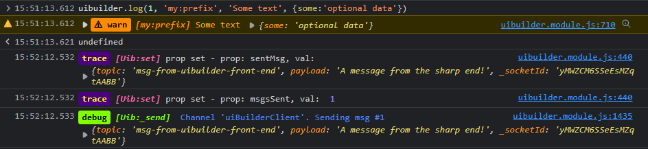

## Variables

### Read/write

Always use `uibuilder.set('varname', value)` to change these.

* `logLevel` - Sets the current logging level. The default is `2` ('error' and 'warn'). Increase to see more detailed logging.
* `originator` - Set to the node ID of a `uib-sender` node if you want any sent messages (back to Node-RED) to only go to that node. Normally, you would not set this manually but rather rely on the library to set it for you when it recieves a msg from a sender node. However, you might want to save and reconstitue it if you need to send general messages before returning a message to the sender node.

### Read only

Always use `uibuilder.get('varname', value)` to obtain the value of these. You can also use `uibuilder.onChange('varname', (val)=>{})` to watch for changes to them. Or you can also use the custom event `uibuilder:propertyChanged` if you really want to.

* `meta` - module metadata (version, type, displayName)
* `clientId` - Client ID set by uibuilder on connect
* `cookies` - The collection of cookies provided by uibuilder
* `ctrlMsg` - Copy of last control msg object received from sever
* `ioConnected` - Is Socket.IO client connected to the server?
* `lastNavType` - Remember the last page (re)load/navigation type (navigate, reload, back_forward, prerender)
* `msg` - Last std msg received from Node-RED
* `msgsSent` - The number of messages sent to server since page load
* `msgsReceived` - The number of messages received from server since page load
* `msgsSentCtrl` - The number of control messages sent to server since page load
* `msgsCtrlReceived` - The number of control messages received from server since page load
* `online` - Is the client browser online (true) or offline (false)?
* `sentCtrlMsg` - The last control msg object sent via uibuilder.send()
* `sentMsg` - The last std msg object sent via uibuilder.send()
* `serverTimeOffset` - Time offset between browser clock and server clock
* `socketError` - Holds the details of the last socket error

## Functions

Functions accessible in user code.

### `start(options)` - Starts Socket.IO communications with Node-RED

!> In most cases, you no longer need to call this yourself. The client startup is now more robust and should rarely need any help. The exception will be if you are loading a page from an external server instead of from Node-RED.

Unlike the original uibuilder client, this version:

* Rarely needs to be manually called. It should work for all page locations including in sub-folders as long as the client allows cookies.
* Only allows passing of a single options object.
* Allows being called again which will reset the Socket.IO connection and internal msg event handlers.

While multiple properties can be given in the options object, only the following are currently used:

* `ioNamespace` - This is normally calculated for you. However, if using an external server to serve the page, you may need to manually set this. Check the uibuilder node details page in the Node-RED Editor for what this should be set to.
* `ioPath` - As above.
* `loadStylesheet` - (default=true). Set to false if you don't want the uibuilder default stylesheet (`uib-brand.css`) to be loaded if you haven't loaded your own. Checks to see if any stylesheet has already been loaded and if it has, does not load.

### Message Handling
#### `send`
#### `sendCtrl`
#### `eventSend`

### Variable Handling
#### `get`
#### `set`
#### `getStore`
#### `setStore`
#### `removeStore`
#### `setPing`

### UI Handling

These are the new dynamic, configuration-driven UI features. They let you create your UI dynamically from simple data sent to the client.

In addition, internal message handling will recognise standard messages from node-red and process them. So these functions won't always be needed.

#### `loadScriptSrc` - Attach a new remote script to the end of HEAD synchronously
#### `loadScriptTxt` - Attach a new text script to the end of HEAD synchronously
#### `loadui` - Load a dynamic UI from a JSON web reponse

### Event Handling

#### `onChange` - Register on-change event listeners for uibuilder tracked properties

Returns a reference to the callback so that it can be cancelled if needed.

Uses the `uibuilder:propertyChanged` event internally.

#### `cancelChange` - remove all the onchange listeners for a given property
#### `onTopic` - like onChange but directly listens for a specific topic
#### `cancelTopic` - like cancelChange for for onTopic

### Other

#### `$` - Simplistic jQuery-like document CSS query selector, returns an HTML Element

#### `setOriginator`
Set the default originator. Set to '' to ignore. Used with uib-sender.

#### `log` - output log messages like the library does

Use as `uibuilder.log(1, 'my:prefix', 'Some text', {some:'optional data'})` which produces:

First argument is the log level (0=Error, 1=Warn, 2=Info, 3=log, 4=debug, 5=trace). If the uibuilder logLevel variable is set to less than the requested level, the output will not be shown. The names can be used instead of the numbers.

## Custom Events

Custom events are all attached to the DOM `document` object. Additional custom data may be added to the `detail` object of the event object.

### `uibuilder:propertyChanged` - when uibuilder.set is called (externally or internally)

Used internally be the `onChange` function but can also be used directly if preferred.

The new value of the property is provided on the events `detail` object.

### `uibuilder:stdMsgReceived` - when a non-control msg is received from Node-RED

The message content is provided on the events `detail` object.

### `uibuilder:msg:topic:${msg.topic}` - when a std msg with a msg.topic prop is received

The message content is provided on the events `detail` object.

### `uibuilder:msg:_ui` - when a std msg with a msg._ui property is received

The message content is provided on the events `detail` object.

### `uibuilder:msg:_ui:${action.method}${action.id ? `:${action.id}` : ''}` - output for each action on receipt of a std msg with a msg._ui property

The action details are provided on the events `detail` object.

### `uibuilder:socket:connected` - when Socket.IO successfully connects to the matching uibuilder node in Node-RED

The connection count is provided on the events `detail` object.

### `uibuilder:socket:disconnected` - when Socket.IO disconnects from the matching uibuilder node in Node-RED

The disconnect reason is provided on the events `detail` object if available. May be a string or an error object.
