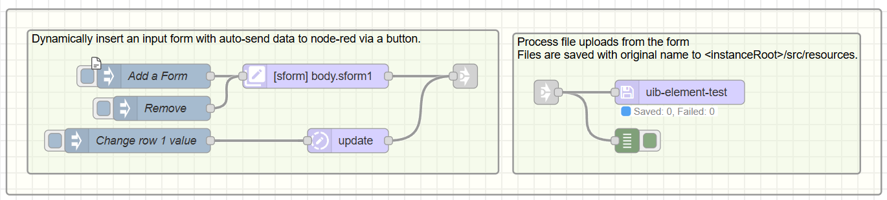

## No-code forms

UIBUILDER includes the `uib-element` nodes which contains an option for creating an HTML form from simple data. Please load the No-code example from the Node-RED library. That contains an example for creating a form without code.

The example has embedded JSON input data in the inject node that you can use to learn how to create different inputs.

Submit and cancel buttons are automatically added to the form if you don't include them in the input data. The form sends the users input to the uibuilder node when they click the submit button. The cancel button will clear the form inputs.

The format of the data returned to Node-RED is standardised and uses the front-end `uibuilder.eventSend(event)` function so you don't need any code to handle the form submission.

The created form is in a simple layout controlled by default by the `uib-brand.css` file. You can change the layout by editing that file or by creating your own CSS file and linking it in your front-end code. It also includes some additional dynamic handlers that record the previous input value.

As always with the UIBUILDER no-code nodes, the output of the node uses the low-code JSON data format. This makes it easy to add further changes. The low-code format remains close to HTML so it is easy to read and understand but avoids the various oddities of HTML.

> [!TIP]
> You can send the output of the `uib-element` node to a `uib-html` node if you want to use the HTML in a template or Dashboard. You can also send the HTML output on to a `uib-save` node which will permanently update the web page. This reduces the communications overhead of constantly resending the form data to the client and allows the use of standard web caching to further improve performance.

## Code-based forms

You can, of course, create your own forms using standard HTML, CSS, and JavaScript.

If you aren't sure how to do that, use the `uib-element` node to create a form and examine the resulting HTML.

> [!TIP]
> Use the "Developer Tools" in your browser to inspect the HTML and CSS of the form created by the `uib-element` node. This will help you understand how to create your own forms.

Form best practices:

* In general, it is best to have a `label` and an input element for each field in your form. The `label` element should be associated with the input element using the `for` attribute. This improves accessibility and usability.
* You will often want to use both the "name" and "id" attributes for each input element. The "name" attribute is used to identify the input when the form is submitted, while the "id" attribute is used to associate the label with the input element. Name attributes can be duplicated which has useful effects with some input types, such as radio buttons and checkboxes. The `id` attribute must be unique within the document.

To submit the form data back to Node-RED, include a `<button type="button" onclick="uibuilder.eventSend(event)" id="sform1-btn-send">Send</button>` element. The called standard function will collect all of the form inputs and send them to the uibuilder node.

> [!NOTE]
> Note the use of `type="button"`. This ensures the the button does not trigger the default browser action which would result in the page being reloaded.

If you include a `<button type="reset">Reset</button>` element, it will clear all of the form inputs when clicked.
