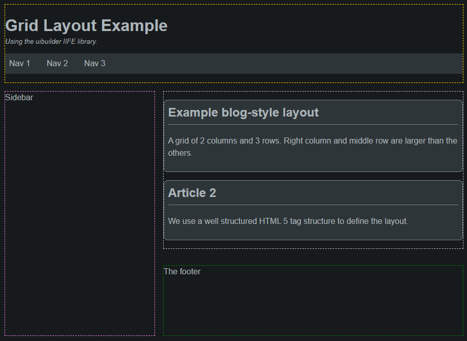

Layouts are generally the starting block of your UI. They provide the structure within which you can place your content. This example shows a simple grid layout that can be used for a blog or similar content-heavy site.

It is based on the CSS Grid layout system. This is a powerful and flexible way to create complex layouts with minimal code.

## Example Code

There is a fully working example of this layout in the Node-RED examples import library for uibuilder. It is under the "Layout Examples" section and is called "dashboard-grid".

## Visual Structure

The basic visual structure consists of the following areas:

- **A header** - contains the title and a horizontal navigation menu. *Outlined in yellow dashes in the example.*
- **A main content area** - acts as a container for a series of "arcticles" show in card format. *Outlined in grey dashes.*
- **A sidebar** - Empty in this example but often used for navigation or additional content. *Outlined in purple.*
- **A footer** - Empty in this example but generally used for copyright and other information. *Outlined in green.*

In the example code, there is a dotted line around each of these areas just to illustrate the layout, this is easily removed by changing the obvious entries in te CSS file.

Note that this structure is "responsive". Which is to say that, on narrower screens, each area will stack on top of each other. This is done using  `@media` CSS rule specifying the width in pixels where the change happens. That responsive width is set to `37.5em` in this example. You can change this to suit your needs.

### Basic CSS rules for grid layouts

CSS can get extremely complex if you aren't careful. However, there are a few basic rules that should help keep things simple but still flexible. Allowing you to adapt this basic layout to your needs.

- When defining CSS grids of any but the simplest type, always use `grid-template-areas`. This allows you to define the layout in a simple way. It also allows you to easily change the layout by changing the grid template areas. This is much easier than trying to change the grid columns and rows.

Refer to [Style Best Practice](/creating-uis/css-best-practice.md "Some simple guidelines and good practices for creating flexible layouts using CSS") for additional guidelines.

## Additional code examples

Just the body section of the HTML.

```html
<body>
  <div>
    <header class="header">
      <h1 class="with-subtitle">Dashboard Layout Example</h1>
      <div role="doc-subtitle">Using the uibuilder IIFE library.</div>
    </header>

    <main>
      <article>
        <h2>Card 1</h2>
        <p>
          The main content area contains a series of cards (AKA widgets).
        </p>
      </article>

      <article>
        <h2>Card 2</h2>
        <p>
          We use a well structured HTML 5 tag structure and CSS to define the layout.
        </p>
      </article>

      <article>
        <h2>Card 3</h2>
        <p>
          This could contain anything of course.
        </p>
      </article>

      <article>
        <h2>Card 4</h2>
        <p>
          This could contain anything of course.
        </p>
      </article>

      <article style="--article-width: 7;">
        <h2>Card 5</h2>
        <p>
          This has an overridden width, see the HTML. Sets the number of grid columns used, there are 12 total in the default example but you can change this to anything in the CSS file.
        </p>
      </article>

      <article style="--article-width: 5;">
        <h2>Card 6</h2>
        <p>
          Also changed width. The <code>--article-width</code> CSS variable is all that needs to be set.
        </p>
      </article>
    </main>

    <aside class="sidebar">
      <nav class="nav-side">
        <ul>
          <li><a href="#nav1">Nav 1</a></li>
          <li><a href="#nav2">Nav 2</a></li>
          <li><a href="#nav3">Nav 3</a></li>
        </ul>
      </nav>
    </aside>

    <footer>
      The footer
      <div>2nd footer</div>
    </footer>
  </div>
</body>
```

```css
/* Load defaults from `<userDir>/node_modules/node-red-contrib-uibuilder/front-end/uib-brand.min.css`
 * This version auto-adjusts for light/dark browser settings.
 */
@import url("../uibuilder/uib-brand.min.css");

/* CSS variables to make it easier to control */
:root {
    /* The layout container */
    --container-max-width: 1000px;
    --container-col-gap: 1rem;
    --container-row-gap: 1rem;

    /* The main content container */
    --main-cols: repeat(12, 1fr);
    --main-rows: auto;
    /* auto OR repeat(12, 1fr); ... */
    --main-col-gap: var(--container-col-gap);
    --main-row-gap: var(--container-row-gap);

    /* The articles */
    --article-width: 3;
    /* number of columns or auto */
    --article-height: auto;
    /* auto or number of rows */

    /* The Sidebar container */
    --sidebar-max-width: 1fr;
    --sidebar-min-width: 0.1fr;
}

/* The outer container div */
body > div {
  width: 100%;
  max-width: var(--container-max-width);
  margin: 0 auto;
  /* Center the container horizontally */
  display: grid;
  gap: var(--container-row-gap) var(--container-col-gap);

  /* 2 cols x 3 rows layout. Middle row & right column are larger. Left col is constrained min/max */
  grid-template-columns: minmax(var(--sidebar-min-width), var(--sidebar-max-width)) var(--main-width);
  grid-template-rows: 0fr 1fr 0fr;
  grid-template-areas:
    "header header"
    "sidebar main"
    "sidebar footer";
  justify-items: stretch;
}

/* The main content container */
main {
  /* Where you put your content */
  grid-area: main;

  display: grid;
  gap: var(--main-row-gap) var(--main-col-gap);
  grid-template-columns: var(--main-cols, 12);
  /* fallback to 12 cols */
  grid-template-rows: var(--main-rows, auto);
  /* fallback to auto */
}

/* Any article within the main container.
   You can use a div instead of an article, useful for no-code uibuilder elements. */
main>article,
main>div {
  /* Width of an article in number of columns */
  grid-column: span var(--article-width);
  /* Height of an article in number of rows */
  grid-row: span var(--article-height);
  margin: 0;
}

/* Set a child div to have same format as an article */
main>div {
  border: 1px solid var(--text3);
  border-radius: var(--border-radius);
  padding: var(--border-pad);
  margin: 0;
  background-color: var(--surface3);
}

main>div>h2,
main>div>h3,
main>div>h4 {
  margin-block-start: 0;
  border-bottom: 1px solid var(--text3);
  padding-block-end: var(--border-pad);
}

header {
  /* Headings, nav, etc */
  grid-area: header;
}

footer {
  /* at the bottom, (c), dates, etc */
  grid-area: footer;
  margin-top: 0;
}

/* We might want other sidebars so be more explicit for this */
aside.sidebar {
  /* stuff to one side of the main content */
  grid-area: sidebar;
}

/*#region Simple horizontal navigation main menu (in the header) */
.nav-main {
  background-color: var(--surface3);
}

.nav-main ul {
  /* Remove bullet points */
  list-style-type: none;
  /* Remove default padding */
  padding: 0;
  /* Remove default margin */
  margin: 0;
  /* Use Flexbox to align items horizontally */
  display: flex;
}

/* Add space between menu items */
.nav-main li {
  margin-right: 1rem;
}

/* Remove margin on the last item */
.nav-main li:last-child {
  margin-right: 0;
}

.nav-main a {
  /* Remove underline from links */
  text-decoration: none;
  /* Add padding for better click area */
  padding: var(--border-pad);
  /* Ensure the entire area is clickable */
  display: block;
}

/* Highlight on hover */
.nav-main a:hover {
  background-color: var(--surface5);
  /* Optional: Add rounded corners */
  border-radius: var(--border-radius);
}

/*#endregion */

/*#region simple vertical navigation menu */
.nav-side {
  background-color: var(--surface3);
}

.nav-side ul {
  /* Remove bullet points */
  list-style-type: none;
  /* Remove default padding */
  padding: 0;
  /* Remove default margin */
  margin: 0;
}

.nav-side a {
  /* Remove underline from links */
  text-decoration: none;
  /* Add padding for better click area */
  padding: 0.5rem 1rem;
  /* Ensure the entire area is clickable */
  display: block;
}

/* Highlight on hover */
.nav-side a:hover {
  background-color: var(--surface5);
}

/*#endregion */

/* Adapt for narrow screens */
@media only screen and (max-width: 512px) {
  :root {
    /* --article-width: 12; */
  }

  /* Very simple adaption example, a single column, 4 rows */
  .container {
    gap: 0.5rem;

    /* 1 cols x 4 rows layout. 2nd row is larger */
    grid-template-columns: 1fr;
    grid-template-rows: 0.1fr 1fr 0.1fr 0.1fr;
    grid-template-areas:
      "header"
      "main"
      "sidebar"
      "footer";
  }

  /* We want the articles in a single col now so just display as block */
  main {
    display: block;
  }

  /* And add a bit of a top margin to articles for clarity */
  main>article,
  main>div {
    margin-top: 0.5em;
  }
}
```
