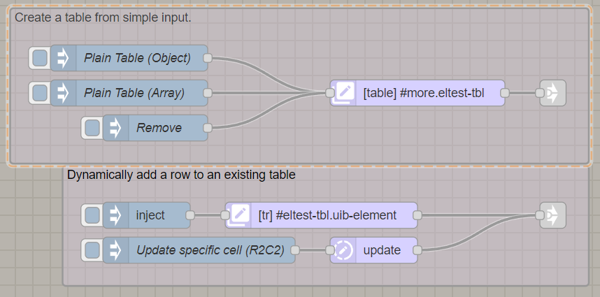
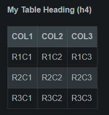
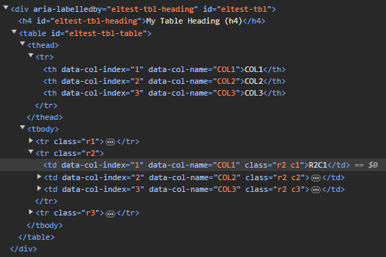
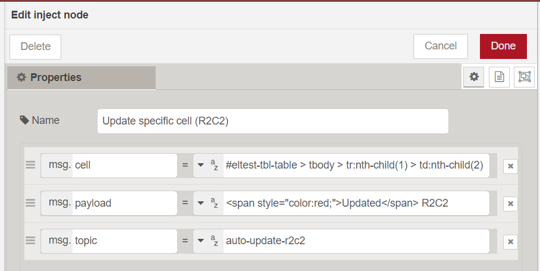

*(This document is a work-in-progress, it is not complete)*

The simplest way to create a table using UIBUILDER is using the `uib-element` node set to output a table definition. 

You feed it an array of objects where each property of the object is a table column. Then feed the output to a uibuilder node and it creates the table automatically on any connected client. You use the uib-cache node to handle caching to deal with page reloads and new client connections.

There is an example flow that demonstrates ALL of the available elements including tables and that is probably the best way to get started as it has everything needed including test data.



With the output looking like:



The important thing to note is that the element node simply creates the initial table. What you end up with in the page is a bunch of usable HTML with column/row/cell ids that let you further manipulate things.



There is another element type that adds a row to a table.

## Updating cells

However, to update a specific cell dynamically, you can use the `uib-update` node with the cell identifier you want to change. The example already mentioned shows how:



There are other ways but this is probably the simplest even though the CSS Selector looks at first sight to be complex. All it is saying is select the 2nd column of the 2nd row of the table body.

If you are not familiar with [CSS Selectors](/how-to/css-selectors) (which UIBUILDER uses extensively), on a web page, open up the dev tools select an element on page and you can copy the selector. Here is what my browser gave me to select that cell:

```css
#eltest-tbl-table > tbody > tr.r2 > td.r2.c2
```

Which uses the class names that are added to the table rows and cells. Alternatively, the following could also have been used: `#eltest-tbl-table > tbody > tr:nth-child(1) > td:nth-child(2)` which uses child selectors instead.

> [!WARNING]
> Using the row class names, `r2`, `r3`, etc does not work correctly if you dynamically add rows. Use child selector syntax if you may need to dynamically change the size of the table.

Note that `#eltest-tbl-table` is the HTML id given to the table. You will note that there is an outer `<div id="#eltest-tbl">`. The id for that is provided by you in the `uib-element` node configuration.

> [!TIP]
> In the dev tools console, you can use UIBUILDER's easy element selector to test out your CSS Selector. It works very similarly to jQuery selectors:
> 
> ```js
> $('#eltest-tbl-table > tbody > tr.r2 > td.r2.c2')
> // or
> $('#eltest-tbl-table > tbody > tr:nth-child(1) > td:nth-child(2)')
> ```

## Formatting

Formatting is currently a little more complex than I'd like. However, *the content of a cell can be HTML*.

If you need to apply standard colouring - lets say for a particular mode or status, you can extend your initial table setup flow with some post-processing.

## Adding table rows

You can append or insert table rows to an existing table using the "Add row to existing table" element type.

You must provide the _parent_ id of the table (e.g. the id provided when you add a table using `uib-element` which is applied as a parent `div` to the table itself).
