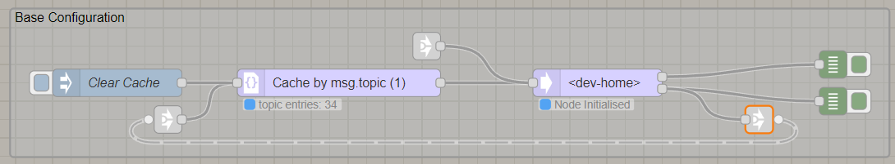
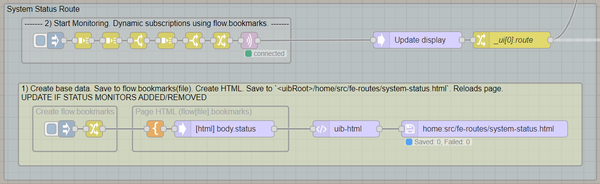
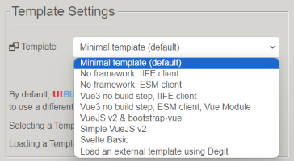
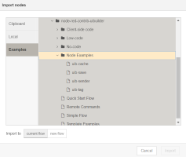

> [!TIP]
> The best way to get started is to add a uibuilder node or import one of the examples, then start playing. You will soon get the hang of it.

Here is an example of a UIBUILDER basic flow:

> You have 2 input links, one of which goes via the cache node which means that any newly connected client will get the cached data straight away. The link-out/-in loop at the bottom ensures that newly connected clients inform the cache that they need it, you only need the link, nothing else, it is automatic. Any user or automation at the client end will appear as messages in the top most debug output, obviously, you will replace that will any processing you need to do.

Now you can decide how you want to build your UI. You can craft it by hand, use external editors, create configuration JSON or use one of the no-code nodes. Or even use any combination of these styles - UIBUILDER never locks you in!

Once you have some UI, you can now send and receive data messages to and from your connected browser pages and Node-RED. Using them to update the UI and get user input.

> This shows some setup that you only need to run manually once, it updates an HTML file for you. The top section auto-starts when Node-RED does and triggers a set of MQTT subscriptions that are then processed and output to the target uibuilder node (the line top-right goes off to a link-out connected to the uibuilder node). This is an example of a relatively complex flow for sending data to your web app.

UIBUILDER comes with *templates* to give you some front-end code to get you started. Load a different template if you like, use the editor to customise the UI code (or do that externally using VSCode). Use the library manager if you need any front-end libraries or frameworks (this adds the appropriate folders to the web server so that you can access them from your UI).

UIBUILDER also comes with a number of *example flows*. These are accessed from Node-RED's "hamburger" menu, import entry. They are fully working flows that demonstrate the use of UIBUILDER.

## Installation

Install UIBUILDER normally using Node-RED's Palette Manager from the hamburger menu. Search for `node-red-contrib-uibuilder`.

If you need to install a different version or a development build, you can install manually using `npm` in Node-RED's `userDir` folder.

## Your first web app

Try out "[A first-timers walkthough of using UIBUILDER](walkthrough1.md)" to walk through a complete example to get you going.

## More information

* [Video series on YouTube](https://www.youtube.com/watch?v=IVWR_3cx05A&list=PL9IEADRqAal3mG3RcF0cJaaxIgFh3GdRQ)
* [Did you know?](did-you-know.md) - Things you might not know about UIBUILDER, hints and tips
* [Creating data-driven web apps with UIBUILDER and Node-RED](web-app-workflow.md) - Different styles and workflows you can use
* [Configuring UIBUILDER](uib-configuration.md) - Configure the UIBUILDER platform. Affects all `uibuilder` nodes
* [Standard messages](pre-defined-msgs.md) - A catalogue of messages and properties
* [Creating Templates](creating-templates) - Pre-defined and reusable front-end code, dependencies, and optional build steps
* [Browser auto-refresh](browser-refresh.md) - Automatically reload your page after a change
* [Zero-code UI creation](using/zero-code-ui.md) - Dynamically creating web UI's
