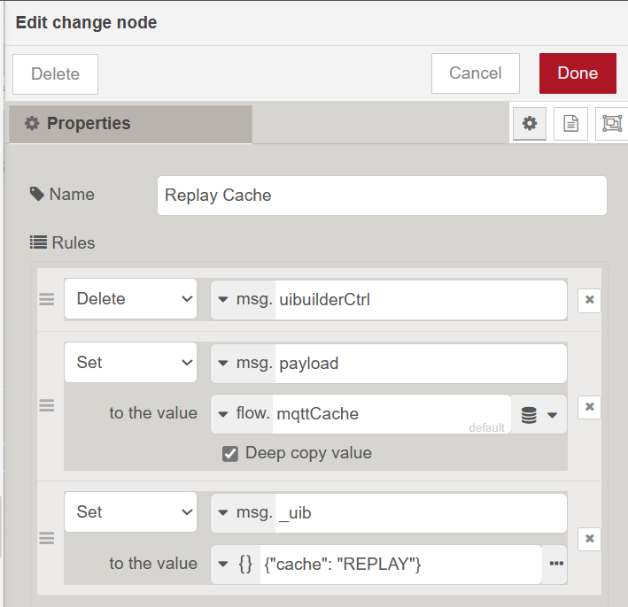

The cache node was added in uibuilder v5. It provides an easy method of saving messages in a cache and replaying them
when needed. Typically when a client browser loads or reloads a uibuilder web page.

The cache uses Node-RED's build-in `context` stores for the cache. This is a very flexible approach and can cater for both restart-safe (file or database) and restart-cleared (memory only) stores.

> [!NOTE]
> Most of Node-RED's context stores keep all variables completely in-memory. So you must take care over the size of any caches you use.

## Using the cache node

Note that you can use the `uib-cache` node independently of uibuilder if you wish. See the [pre-defined messages](pre-defined-msgs) page for details of the `REPLAY` and `CLEAR` cache control messages.

Otherwise, usage of the node is as simple as adding it to your flow. Typically before a uibuilder node.

Any message sent into the node will be cached according to the settings given.

If you connect the uibuilder node's #2 lower output port to the input, clients will automatically request a
replay of the cache whenever they connect.

### Grouping

Typically you will provide a `msg` property such as the default `topic` (`msg.topic`) to group your cached messages by.

In this case and using the other defaults, the last message for each `msg.topic` value will be saved in the cache.
If a new message with the same topic arrives the old message will be removed and the new one saved.

If you change the number of messages to be retained to a higher number, say 4, then the last 4 messages for each
topic will be retained and replayed on request.

If you use a property that doesn't exist, you will get messages stored in the `undefined` category. 
This is also the case if you choose the option to cache each message individually.

If you set the number of messages to be cached to zero, the node will not remove any old messages from the cache, 
you will have to periodically empty the cache using a control message. See below regarding using flow/global contexts for an alternative.

#### Caveats

When grouping by a msg property, note that the property **must** contain a string. Other data types may behave inconsistently. In addition, the string should not be an empty string as that is ignored by the cache.

### Context Stores

The node uses Node-RED's built-in context storage library to retain the data.

By default, this retains data in memory. You can define alternative stores and define which store is
default in the `contextStorage` property in `settings.js`.

When you have more than one storage module set up, you can choose between them in the node.

If you switch to another storage method, you may want to delete the old version of the `uib_cache` context variable
manually as it will not be deleted automatically at present.

As of v5.1, you can also specify the store type and store variable name to use. By default, the "Node" type is used. That type restricts access to the individual node-instance and means that no variable name clashes can happen. If flow or global types are chosen, access and update is possible from other nodes/flows. In that case, care must be taken not to end up in an invalid situation (e.g. deleting the variable even though the cache node still expects it to exist).

If using the flow or global stores, you can change the name of the variable that is used in case you need more than one instance of this node or in case the existing name clashes with something else.

## Limitations

Memory is the biggest limitation, trying to cache too many entries **will** eventually crash Node-RED. This can 
be hard to predict as it depends on a lot of variables. Caution is advised.

The "Cache by" (group-by) `msg` property must contain string values, other data types will be handled inconsistently if at all. The string value cannot be an empty string because that is ignored.

Using `flow` or `global` cache types exposes the data to other nodes which could change the entries. This might be useful in some cases since it provides alternatives to simply sending the data into the cache node. These could be used for much more complex processing if needed. However, obviously this must be treated with caution. 

Also, when using `flow` or `global` types, you are able to change the name of the variable. Make sure that the name does not clash with other use.

## Alternatives

There are a couple of important alternatives to using the cache node that may, in some circumstances, be better.

### Using the uib-save node with the current UI

In some cases, you may want to persist the whole UI back to a static file. This may give you a significant performance boost for complex pages and large numbers of connected users.

To do this, you can send an `sendHtml` command to one of the connected clients. Feed the resulting `msg` directly into the `uib-save` node remembering to set the output file to `index.html` if you want to replace the default page.

### Using the uib-save node with UI generated in Node-RED

Another alternative is to create a UI completely in Node-RED. You can use the `uib-html` node to do this with both no-code and low-code configurations.

The html node has an flag to "Merge HTML Template?" which should be checked. If no `msg.template` is supplied and this flag is set, the node will wrap the resulting HTML in uibuilder's current "Blank" template. Alternatively, you can provide your own template string.

### Using a context variable

By connecting the output from uibuilder's port #2 to a switch node to filter on `msg.uibuilderCtrl` being equal to "client connect" (and optionally filtering for specific pages/clients) and then using that to trigger a change node that outputs back into the uibuilder node with settings like this:

You can set up a manual cache using a context variable.

Obviously, this does have some dangers that need to be managed. Namely that some other flow process could change the cache context variable. But this could also be an advantage since many things could now update the cache if needed.

Of course, since the cache would only be delivered on a page load, you would also need to deal with dynamic updates if needed.
