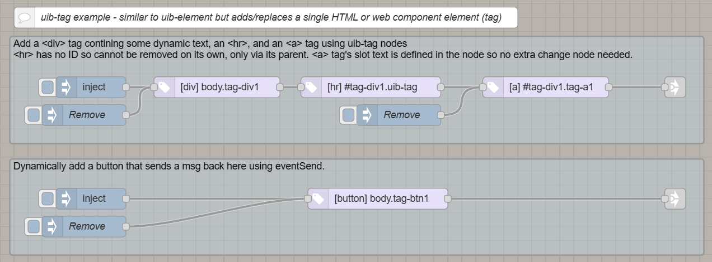
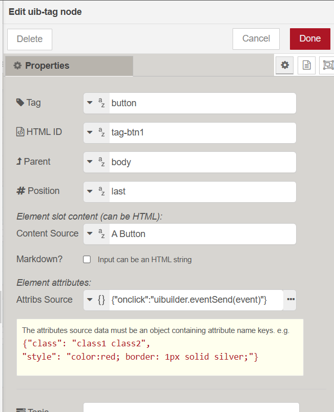

*(This document is a work-in-progress, it is not complete)*

Available from uibuilder v6.5.0.

With the `uib-tag` node, you can add ANY HTML or custom web component tag to your web page with zero-code.

With this node configuration: 

You get a simple button that, when clicked, will send a standard message back to Node-RED immediately.

The node's configuration fields are the same as the other zero-code nodes.

>[!NOTE]
> - The output does not get wrapped in a `div` unlike most of the `uib-element` outputs.
>
> - For Markdown to be rendered, you have to have loaded the [Markdown-IT library](https://markdown-it.github.io/). [Details are documented here](client-docs/readme?id=_2-markdown-it-converts-markdown-markup-into-html).
