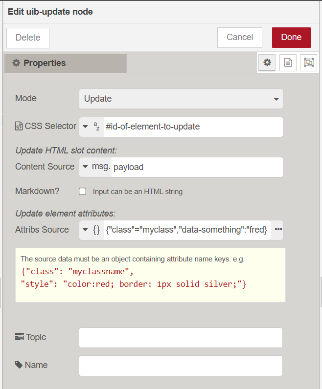
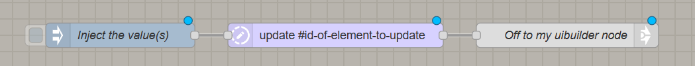

Outputs msg._ui low-code config data that the uibuilder client library can turn into full HTML. (Same format as the `uib-element` node)

Can also delete (remove) existing elements. Note that in delete mode, this node will remove **ALL** element specified by the CSS Selector. e.g. if you specify a selector of "li", every list entry from every list on the page will be deleted. Use with caution.

In update mode (the default), any combination of attributes (e.g. class, style, etc) and inner content (the so-called "slot" content) can be updated. Slot content can be text, HTML or (if the `markdown-it` library is loaded) Markdown.

The "Content Source" replaces the _slot_, the content between the opening and closing tag that was selected by the *CSS Selector*. HTML text is allowed (and even Markdown if you've loaded the front-end Markdown-IT library).

The Attribs are a JS object with attribute names as the keys and the values as the values. They can be dynamic as well as static of course.

