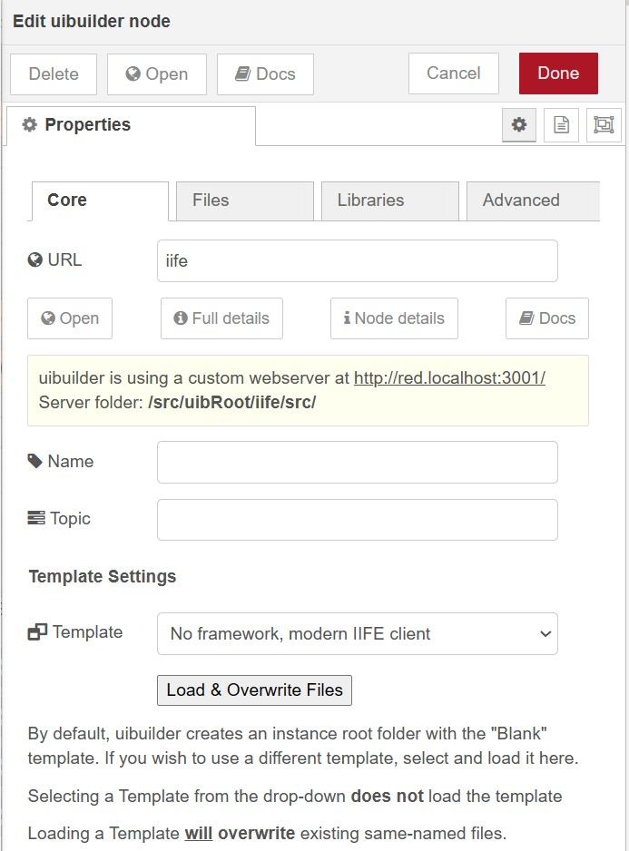
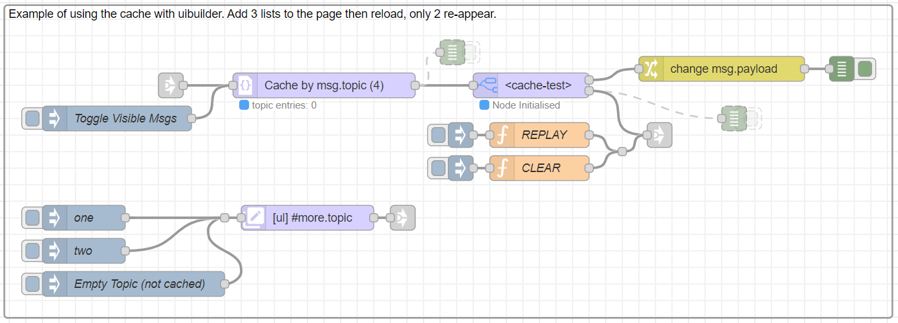

> [!note]
> This page is about configuring an individual uibuilder node in the Node-RED Editor. If you are looking for how to configure uibuilder as a whole, please refer to the [Configuring uibuilder](uib-configuration.md) page.

A uibuilder node that has been added to a flow is configured using its Editor configuration panel. Open this by double-clicking on the node you want to configure.

> [!tip]
> When setting up a new uibuilder node, you will note that you cannot change many settings until you have set the URL and deployed the change. This is to ensure that the node has the server folder to work with. Once the folder exists, you can make other changes.

The panel is split into several tabs: Core, Files, Libraries, and Advanced.

## Node configuration

### Core Tab

This is the main tab.

#### URL

The URL field defines the last part of the URL for this uibuilder instance. 

A URL of `test` will result in a full URL that looks something like `http://localhost:1880/test`. (Yours may look different depending on the configuration of Node-RED's settings).

The Open button just below the URL will open this default location. The actual file that is opened is `/test/index.html`.

The URL **MUST** be unique across all URL's whether they belong to uibuilder or not. The input box will not let you type an entry that already exists in another uibuilder instance. However, it cannot check all the possible URL's Node-RED is capable of supporting so please take some care when choosing an appropriate name here. 

Setting the `httpNodeRoot` property in `settings.js` will help avoid name clashes as will using a custom server for uibuilder (see below).

The URL also defines the folder on your server's filing system where all of the front-end code will live. It creates a sub-folder under the `<uibRoot>` folder which is typically `~/.node-red/uibuilder` but may be moved anywhere by using the `uibuilder.uibRoot` settings in your `settings.js` file.

If you have deployed the node with a specific name and then later change it, uibuilder will automatically rename the server folder as well. If you delete the node, uibuilder will offer to delete the folder but you may choose to keep it if you wish.

URL's have some other requirements that must be met, if you don't meet the requirements, you will see one or more errors listed underneath the field and you will not be able to press the "Done" button until they are corrected.

If copying and pasting a uibuilder node or a flow containing a node, upon pasting, the URL is reset to blank. Since this is an error, the node will be marked with a red triangle and attempting to deploy will give an error.

#### Buttons

The buttons below the URL field will each open a new browser tab. The Open button has already been described.

The `uibuilder Details` button opens a page showing the full configuration of uibuilder along with all of the admin and user-facing ExpressJS web server routes that have been mounted by all instances of uibuilder nodes.

The `Instance Details` button opens a page with a summary of the configuration and web routes for this instance.

The `Docs` button opens the local copy of this documentation.

#### Info panel

Under the buttons is the information panel. This shows you the detail for the webserver that uibuilder is currently using. This ensures that you know what URL prefix to use in front of the URL defined above.

#### Name and Topic

These are optional. If you set a Name, it will show in the icon in the flow along side the URL. This is the standard Node-RED name field.

The Topic string will be added to messages being sent to the front-end if the inbound message to the node does not contain a topic field. So consider it a default entry.

#### Template Settings

> [!NOTE]
> Changing the template overwrites existing files with the same names in your `<uibRoot>/<url>` server folder. So make sure you take copies before pressing the Load button if you don't want to loose them.

uibuilder Templates let you have a rapid prototype for your front-end code. The Templates load a complete set of front-end files along with a README and an npm style `package.json` file. This allows a template to be a complete working model, ready to go.

As at uibuilder v5, there are 4 built-in Templates plus the ability to load external templates from GitHub and elsewhere. More information on templates can be found in the [Configuring uibuilder](uib-configuration?id=ltuibrootgtltinstance-urlgt) page and in the [Creating Templates](creating-templates) page.

### Files Tab

This tab allows you to manage the files in the server folder for this instance of uibuilder.

You can create, delete and edit files here.

> [!NOTE]
> If you want to do any amount of file/folder editing, it is recommended to use a full code editor such as Visual Studio Code or similar. The built-in editor is very basic and does not have many of the features you might expect from a full editor. VS Code has a well supported remote editing feature that allows you to edit files on a remote server directly from your local machine.
>
> The Advanced tab has a setting that enables a direct link to your chosen editor assuming that it allows custom URL schemes. By default, this is set to Visual Studio Code but you can change it to any editor that supports custom URL schemes.

### Scripts Tab (Since v7.5.0)

This tab allows you to manage and run npm scripts defined in your instance root's package.json file as well as the default npm scripts `outdated`, `update`, and `install`.

These can be any script that can be run on the host OS. They run in the OS's default shell. Output from the script is captured and returned to Node-RED in the panel beneath the list of scripts. When a script is running, a "Kill Script" button is visible, clicking this will abort the script immediately.

If you add/amend scripts using the Files tab, switching back to this tab will update the list.

> [!TIP]
> If using the Svelte framework, which uses Rollup for its build process, if you want dynamic updates as you edit the front-end code, run the `dev` script `rollup -c rollup.config.js --bundleConfigAsCjs -w --environment NODE_ENV:development` _before_ opening the web page (or reload after running the script).

> [!WARNING]
> If you are running a long-running script, you may move to other tabs. However, if you exit the node's config panel while the script is running, you will not see all of the output and you will not be able to cancel the script using the kill button. It will continue to run in a background process. This may be improved in a future release.

### Libraries Tab

This tab allows you to manage the front-end libraries that are available to your front-end code. It uses standard npm packages and you can search for and install any package that is available on the npm repository, or that npm can install for example, from a GitHub repository, or local folder.

You use the standard npm package name which can include @ prefixes, version number suffixes, etc. You can even install multiple versions of the same package by supplying a specification such as `vue2@npm:vue@2` and `vue3@npm:vue@3`. See the npm documentation for more information.

Any front-end library will be installed to the `<uibRoot>/` folder (typically `~/.node-red/uibuilder/`) and will be available to all instances of uibuilder. This ensures that the libraries are not confused with Node-RED's own libraries. The libraries are all exposed via the `../uibuilder/vendor/` URL path. For example, if you install `vue3`, you can access it in your front-end code using `../uibuilder/vendor/vue/dist/vue.global.js`. Check the vendor's library documentation for the correct sub-path to use however as uibuilder's guesses are based on the library's `package.json` file which isn't alway correct.

UIBUILDER will attempt to check for library updates every time you open the Libraries tab. If it finds any, it will show an update message which you can click on. Occasionally, the click may not work, in which case you can simply "Add" the same library again and it will update accordingly.

Each installed library shows an information link which will open the library's declared documentation homepage on the Internet. This is useful for checking the library's API and usage.

Click on the X icon alongside a library to remove it. This will delete the library from the server.

### Advanced Tab

This tab contains a number of advanced settings that you can use to fine-tune the behaviour of the uibuilder node. Most have self-explanitory help text.

Notably, you can:

* Select a server sub-folder to use for serving the front-end code. The default is `src` which contains the default source files. The other commonly used folder is `dist`, this is useful if you are using a build process such as Webpack or Rollup.
* Choose whether to automatically add a `msg._uib` property to all messages from the front-end. This contains information about the client that sent the message. This is optional and off by default since it contains information that might be considered sensitive.
* Add a short and long description. These are used in the uibuilder admin pages such as the Apps Index page to help you remember what this instance is for.
* Manually change the Code Editor URL which lets you easily access the server folder containing this instances files using your preferred code editor. The default uses a local or remote Visual Studio Code custom URL scheme but you can change it for any editor that supports custom URL schemes.

## Message inputs

Any message sent to a uibuilder node input will be forwarded direct to connected clients. With a few exceptions:

* Control messages - Any control message received by a uibuilder node is assumed to be in error and is ignored. If you send a message and it is being ignored, check that it does not have a `msg.uibuilderCtrl` property.

Messages for clients should have the same structure as other Node-RED messages. However, there are some specific formats that the uibuilder client will recognise and automatically process for you. See the [Standard Messages page](pre-defined-msgs) for details. 

Most notably, any message containing a `msg._ui` property will not make it through to front-end user code. It is processed automatically by the uibuilder front-end library. That is the standard property used by uibuilder's [low-code capability](client-docs/config-driven-ui.md).

> [!TIP]
> As of v7, clients automatically _filter_ incoming messages based on `pageName`, `clientId`, and `tabId` properties either in `msg._ui` or `msg._uib`. This means that you can send messages to specific clients or pages without needing to filter them in your flows. This is particularly useful when you have multiple clients connected to the same Node-RED instance.

## Message outputs

uibuilder nodes have two output ports. 

### Standard messages
The upper port (#1) outputs "standard" messages. Typically these are messages that come from client activities such as button presses or form inputs. Any front-end process or code that use either the `uibuilder.eventSend(event)` or the `uibuilder.send({...})` functions.

If the advanced flag "Include msg._uib in standard msg output." is on, uibuilder automatically adds client details to the output under `msg._uib`. Those details may be used for identity and access management flows.

### Control messages

The lower port (#2) outputs "control" messages. These are described in the [Standard messages documentation](pre-defined-msgs#control-message-overview). The messages include client connect and disconnect and visibility change messages.

The most common use of control messages is to loop back to a `uib-cache` nodes so that the cache is replayed to new or reloading clients.

But they can also be used for doing authentication and authorisation controls.
