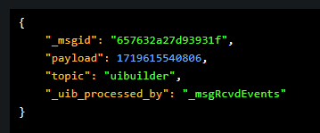

Like UIBUILDER itself, this walkthrough may look complex. But you should bear in mind that if you follow the few steps in the [next](#how-to-get-started-4-steps-to-a-data-driven-web-app) section, that is basically it.
Everything else on this page starts to unpack some of the things that you can then do with UIBUILDER and how to do them. Please consider them as additional walkthroughs.

## How to get started - 4 steps to a data-driven web app

It may look complex, but really it isn't. 😊

1. Install node-red-contrib-uibuilder via Node-RED's "Manage palette" menu.

2. Add a new flow consisting of: `inject -> uibuilder -> debug` nodes connected in that order. 

   
   
   Add debug nodes to both of the output ports of the `uibuilder` node and set them both to show the full msg.

   > [!note]
   > You can import a working example using Node-RED's import menu. Look in the examples section under uibuilder.
   >
   > Don't forget to set the uibuilder node's "URL" (its name) and then Deploy before doing anything else.

3. Double-click on the `uibuilder` node and change it's URL to `uibtest`. Click on the "Done" button.

4. Click on the Node-RED "Deploy" button.
   
**At this point, you now have a working web app!** So, *re-open the uibuilder node and click on the "Open" button* to view the page. This opens a new browser tab showing you your web page.

However, the page doesn't really show or do anything useful yet.


To improve this mostly blank page, re-open the node's settings again and change the _Template_ drop-down to "*No framework, IIFE client*". Then click the "Load & Overwrite Files" button.
You will get a warning that you should carefully read and if OK, click on the "OK, overwrite" button. Of course, if you don't want to overwrite things, click on the cancel button (which is the default).

The rest is really now just testing and getting familiar with the details of how things work.

1. Either reload the page or re-open the `uibuilder` node and click on the "Open" button. This shows the updated page (the template contains all the code).

  

2. In the Editor, cancel the `uibuilder` node's configuration panel and click on the inject node's input button.
   Then check your web page again.
   
   

   You should now see a nicely formatted presentation of the message that the inject node sent to the `uibuilder` node which, in turn, passed it to your front-end client (the browser).

   _So at this point, you know that you can communicate from Node-RED to your browser. If this isn't working, please see the troubleshooting section below._

3. Now check the debug panel in Node-RED.
   
   
   You should see several messages listed there. If you check, you will see that they all come from the second output port of the `uibuilder` node.

   That port outputs uibuilder _control_ messages. The messages tell you where they came from, either the server (the `uibuilder` node itself) or the client and what they represent ("Client Connect" for example).
   You will also see a bunch of other properties that tell you things about the connected client browser tab.

   > [!TIP]
   > The top output port on a `uibuilder` *node* outputs standard messages from your client browser(s). The bottom port outputs control messages mostly generated by uibuilder itself.

   > [!NOTE]
   > Remember that the Node-RED server and the browser client page run in completely *separate contexts* (even if they both run on the same device). The only communication between them happens because the `uibuilder` node talks to the uibuilder client library.

4. Send information back to Node-RED from the browser

   The loaded template has a web FORM pre-defined. You can enter data into the form and press the "eventSend" button. Check out the debug panel in the Node-RED editor and you will see a new message there. Hover over it to see that it came out of the top port of the `uibuilder` node. This is the standard message port. Messages you send from the browser appear here.

   Check the content of the message and you will see that it contains a msg._ui property with lots of pre-defined data. That includes the input from the form. This uses the [helper function](client-docs/functions?id=eventsenddomevent-originator-3939-send-a-standard-message-back-to-node-red-in-response-to-a-dom-event) `uibuilder.eventSend(event)`. This function makes it extremely easy to send useful information back to Node-RED simply by attaching it to an HTML event such as a button click or input field change.

   > [!TIP]
   > `uibuilder.eventSend(event)` and `uibuilder.send({...})` are two of the client library's built in functions and both send information back from the browser client to the Node-RED server.

**You now have a fully working UIBUILDER configuration with a web page and have seen how to send data between Node-RED, the browser, and back.**

## Finding and editing your front-end code

Now that you have the basics running, it is time to look at the front-end code. The important points to remember are:

* The code is completely standard web code using HTML, CSS and JavaScript.

* There is a [JavaScript client library](client-docs/readme), `uibuilder.iife.min.js`, that provides the magic connections between the front and back ends.
  
  See the [uibuilder components overview](components) for a diagram of how the different parts of uibuilder work together with Node-RED and the browser.

  There are two uibuilder client library versions. The one above should be the most commonly used. `uibuilder.min.esm.min.js` is used if you want to use [ES Module](https://hacks.mozilla.org/2018/03/es-modules-a-cartoon-deep-dive/) style coding.


* All of the front-end code for a specific `uibuilder` node (an "[instance](glossary)") is stored in a single folder (with a number of sub-folders).

There are two ways to look at and change the content of an instance's root folder (which, remember, sits on the Node-RED server).

1. Use the built-in "Edit Files" button in the uibuilder Editor panel.
   
   This is best for quick edits and maybe if your server is remote and you do not have easy access to files on it normally.
   However, it is not the best experience as your code starts to get longer and it does not let you keep multiple files
   open.

   1. Click on the "Edit Files" button
   2. Select a file to edit from the drop-down. Noting that you can also change which folder to look in. 
      The folder called "root" is the root folder for this node instance and should contain a `package.json` file, `src` and `dist` folders.
      The folder called `src` will be the one you will most commonly use unless you are using a more complex template and framework such as Svelte.

      See the [web-app workflow](web-app-workflow#code-folders) documentation for more details about the instance folders, what they mean and how to make use of them.

   3. In the `index.html` file, change the the line that says `<h1>uibuilder Modern Client Example</h1>` to `<h1>My Data-Driven Web App</h1>`.
   4. Click the "Save" button.
   5. Reload the web page and see that the title has changed.
   6. Now click on the "Reload connected clients on save" check-box in the Editor. Make another change to the HTML, click save and note that the page auto-reloads.

2. Use a code editor.

   This is best if you are already familiar with writing code for the browser. It is also best if your code is going to be at all complex or you will have more than one person working on different parts of the code.

   To use this approach, you need access to the folder on the server's filing system that contains the root folder for the instance. 
   
   > [!tip]
   > The server location for your code is shown on the node's "Core" tab.
   >
   > There is also a link provided that may open your code editor at the right location. This is set up for VSCode by default but you may change it in the advanced settings for the uibuilder node.

   Each `uibuilder` node instance has a [`url`](glossary) setting. This has to be unique for the instance of Node-RED. It is used as the identifier for the instance. That includes naming the folder that contains the front-end code. For example, if you use the URL from the first part of the walkthrough, the folder would be `~/.node-red/uibuilder/uibtest/`.

   Editing your code and the tools to use are beyond this walkthrough however the [web-app workflow](web-app-workflow#code-folders) page has some additional details.

## Choosing a template

Now that you know where things are, you can decide whether you want to completely do the coding yourself or if you would like some basics from a _Template_.

A uibuilder Template is the complete front-end folder for an instance. It contains a `package.json` file in the root and at least a `src` sub-folder containing `index.html` and `index.js`.

There are a few built-in templates that you can select from along with an option to load templates from GitHub repositories.
The default "Blank" template uses no front-end framework, it is pure, minimal HTML/JavaScript and can be used as a clean palette to create your own code or, in conjunction with the zero-code nodes `uib-element` and `uib-update`, used for dynamic views.

To change templates - firstly note that changing templates will **_completely wipe changes to key files_** from the instance folder. So if you want to keep anything, make sure that you copy or rename files so that they are not overwritten.

Also note that some of the templates require 3rd-party packages to be pre-installed. Some of the templates require `vue@2` (VueJS v2) and `bootstrap-vue` for example. You need to install these using uibuilder's package manager. That will be covered in a separate walkthrough.

Changing templates:

1. Open the uibuilder Editor panel.
2. Click on the "Template Settings" title.
3. Choose a template from the drop-down.
4. If choosing an external template, enter the name as instructed.
5. Click on the "Load & Overwrite" button.
6. Click on the "OK, overwrite" button in the warning dialog. Note that you can cancel up to this point and nothing will be harmed.
7. Reload your web page to see the new page template.

Notes:

* When you reload the web page, any existing data on the page is lost. You can either use the `uib-cache` node ([Using the Cache Node](cache-node)) in Node-RED or the client-side `uibuilder.restoreHtmlFromCache()` function if you have been saving the html updates locally ([HTML/DOM cacheing](http://red.localhost:1880/red/uibuilder/docs/#/client-docs/functions?id=htmldom-cacheing)).
  
  See the example flows and WIKI entries about "Caching" to see how to pre-load data into new/reloaded pages from Node-RED.

* The various templates along with some of the examples show you the different ways to work with the front-end client library depending whether you are using along with a front-end framework library or not.

* There is an external template on GitHub called [`TotallyInformation/uib-template-test`](https://github.com/TotallyInformation/uib-template-test).
  You can use this to see the kinds of things that need to be in a template. Templates are likely to continue to evolve and in the future are likely
  to gain a standard way to have an example flow, include build-steps and more. By all means, create your own templates and share them with the community.

## Displaying data from Node-RED

Send data from Node-RED to your clients in 1 or more standard messages into your `uibuilder` node. The node sends the whole msg to your front-end.

There are multiple ways to display this data on your web page. They are outlined on the [Easy UI updates](using/easy-ui-updates) page.

## Sending data to Node-RED

To send data back to Node-RED, use one of the [Message Handling functions](client-docs/functions?id=message-handling). Both of these will output a message from the topmost output port of your `uibuilder` node. `uibuilder` node's also have an advanced setting that includes additional details in the output about the client. That can be useful for custom authentication and authorisation flows or splitting flows by source page, etc.

### `uibuilder.send(msg)` :id=send

Sends a custom message. The message just includes what you send (plus a `msg._uib` object with additional client details if turned on in the node settings).

```javascript
uibuilder.send(payload: "Hi there from the client", topic: "from the client")
```

### `uibuilder.eventSend(event)` :id=eventSend

<div class="flex-container">

<div class="flex-left">

Can be attached to an HTML event such as a button click (`onclick`) or input field value change (`onchange`). If embedded in a form element (see below), the form's inputs will be automatically included in the `msg._ui` property. Any `data-*` attributes on the source element are included in the payload as well as in `msg._ui.attribs`.

```html
<form>
   <div><!-- Accessible form element -->
      <label for="quickMsg">Quick Message:</label>
      <!-- onchange optional, saves previous value of field -->
      <input id="quickMsg" value="A message from the browser" 
         onchange="this.uib_newValue = this.value" 
         onfocus="this.uib_oldValue = this.value"
      >
   </div>

   <div>
      <button onclick="uibuilder.eventSend(event)" 
         data-type="eventSend" data-foo="Bah"
      >eventSend</button>
   </div>
</form>
```

</div>

<div class="flex-right;">

*Example output*


</div>

</div>

## No-code UI's

uibuilder v6.1 introduced extra features to enable the creation of web pages dynamically without the need to code any HTML or JavaScript. Two nodes [`uib-element`](nodes/uib-element) and [`uib-update`](nodes/uib-update) are used for this.

`uib-element` takes in simple data structures and outputs [`msg._ui` configuration data](client-docs/config-driven-ui) that the client library can re-hydrate straight into HTML. Several simple options such as tables and lists are available in uibuilder v6.1+, additional elements and structures are occasionally added. 

`uib-update` allows simple updating of specific on-page elements. Outputs from both nodes can be chained together and can be sent direct into a `uibuilder` node or via a `uib-cache` node.

The output `msg._ui` configuration data is a defined standard and you can further process that data to enhance it before sending.

uibuilder from v7 has the ability to save this data and to re-hydrate to HTML *within Node-RED* as well so that you can use these features to create HTML for use in other tools and for static page delivery (very efficient).

## Low-code UI's

The data that `uib-element` outputs is [a format that you can use in your own flows](client-docs/config-driven-ui) in Node-RED and even in front-end code if desired. It describes a set of HTML UI elements but does not need you to actually write HTML code. The configuration schema is very flexible and even allows you to load configuration data, HTML, scripts, and new ECMA Modules/Components from external files.

The schema and the UI creator functions built into the front-end client are specifically designed to work with current and future HTML standards in order to avoid the kinds of issues commonly encountered when using 3rd-party front-end frameworks (e.g. major version changes forcing rewrites of all of your tooling). So ES Modules, ECMA Components, and future ECMA versions should all be supported.

It will also work with any framework that does not force you to pre-define all of your UI. [Svelte](svelte) is an excellent example of a well-behaved front-end framework that works nicely with this approach.

## Troubleshooting

Please see the [Troubleshooting](/using/troubleshooting.md) page.
