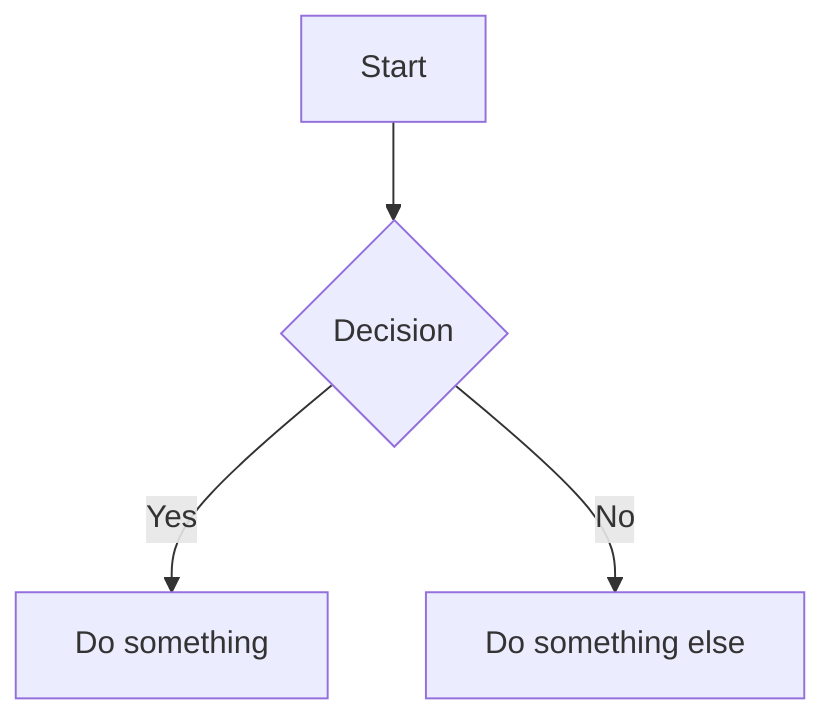

# pluginMermaid (Server-side)

A [markdown-it](https://github.com/markdown-it/markdown-it) plugin for server-side rendering of [Mermaid](https://mermaid.js.org/) diagrams. Fenced code blocks with the `mermaid` language tag are converted to inline SVG at render time, so no client-side JavaScript is needed to display diagrams.

> **Note:** This plugin is currently **commented out** in the default `uib-md-utils` pipeline. It requires the `mermaid` package and an async rendering workflow.

## Syntax

````markdown

````

Any standard Mermaid diagram type is supported (flowchart, sequence, class, state, gantt, etc.).

## How it works

The plugin uses a two-pass approach:

1. **First pass** — The standard `md.render()` call processes all tokens. When a fenced code block with `mermaid` is encountered, the plugin queues an async `mermaid.render()` call and inserts a placeholder string into the HTML output.
2. **Second pass** — The `renderMarkdownAsync()` helper resolves all queued Mermaid promises and replaces placeholders with the actual SVG output.

This design is necessary because `mermaid.render()` is asynchronous, while markdown-it's rendering pipeline is synchronous.

## Usage

The plugin exports two items that must be used together:

```js
import { markdownItMermaidServer, renderMarkdownAsync } from './pluginMermaid.mjs'

// 1. Register the plugin
md.use(markdownItMermaidServer, {
    theme: 'default',
    securityLevel: 'strict',
})

// 2. Use the async render function instead of md.render()
const html = await renderMarkdownAsync(md, markdownSource)
```

### Plugin parameters

| Parameter | Type     | Description                         |
| --------- | -------- | ----------------------------------- |
| `md`      | `object` | The markdown-it instance.           |
| `options` | `object` | Optional configuration (see below). |

### Options

All options are optional. Pass them as the second argument to `md.use()`.

| Option            | Type     | Default           | Description                                            |
| ----------------- | -------- | ----------------- | ------------------------------------------------------ |
| `theme`           | `string` | `'default'`       | Mermaid theme (`default`, `dark`, `forest`, `neutral`). |
| `securityLevel`   | `string` | `'strict'`        | Mermaid security level.                                 |
| `className`       | `string` | `'mermaid-diagram'` | CSS class added to the wrapper `<div>`.                |
| `backgroundColor` | `string` | `'transparent'`   | Background colour for rendered diagrams.                |
| `width`           | `number` | `800`             | Default diagram width.                                  |
| `height`          | `number` | `600`             | Default diagram height.                                 |

## Output

### Successful render

```html
<div class="mermaid-diagram" data-diagram-id="mermaid-a1b2c3d4e">
    <svg><!-- rendered diagram --></svg>
</div>
```

### Render error

When Mermaid cannot parse or render a diagram, the error and source code are displayed:

```html
<div class="mermaid-diagram mermaid-error" data-diagram-id="mermaid-a1b2c3d4e">
    <pre style="color: red; background: #fee; padding: 10px; border-radius: 4px;">
        Error rendering Mermaid diagram:
        Parse error on line 2...

        Diagram code:
        graph TD
            A --> B
    </pre>
</div>
```

## Exports

| Export                   | Type       | Description                                              |
| ------------------------ | ---------- | -------------------------------------------------------- |
| `markdownItMermaidServer`| `function` | The markdown-it plugin function.                          |
| `renderMarkdownAsync`    | `function` | Async wrapper that resolves Mermaid placeholders after render. |

## Styling

```css
.mermaid-diagram {
    text-align: center;
    margin: 1.5em 0;
}

.mermaid-diagram svg {
    max-width: 100%;
    height: auto;
}

.mermaid-error pre {
    color: hsl(0, 70%, 45%);
    background: hsl(0, 80%, 97%);
    padding: 1em;
    border-radius: 0.25em;
    overflow-x: auto;
}
```
