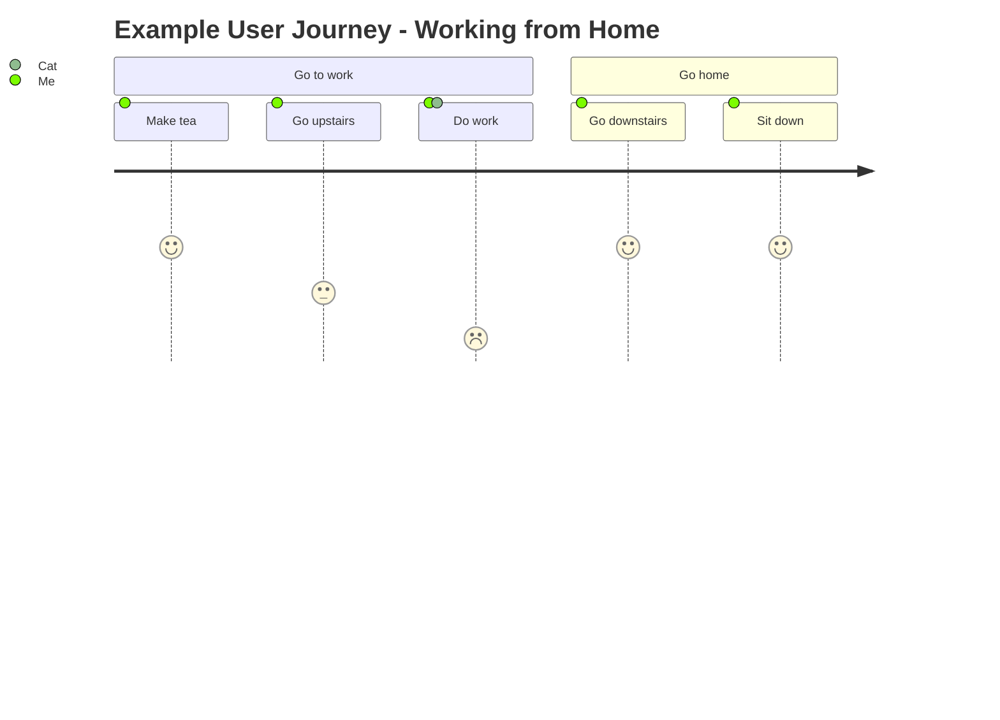
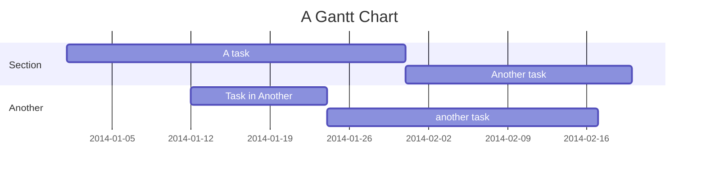
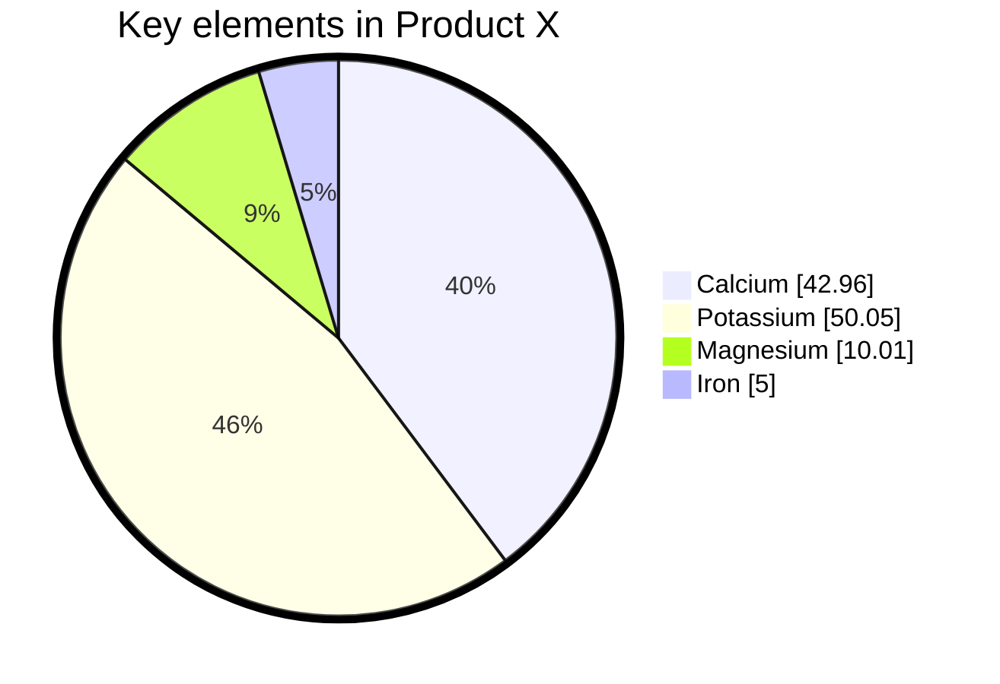
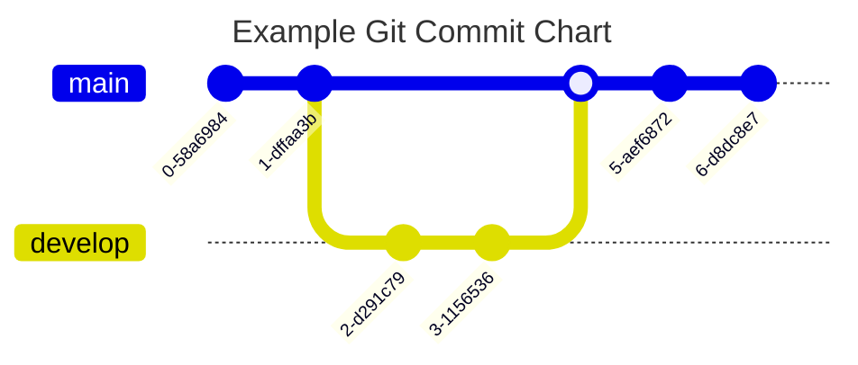
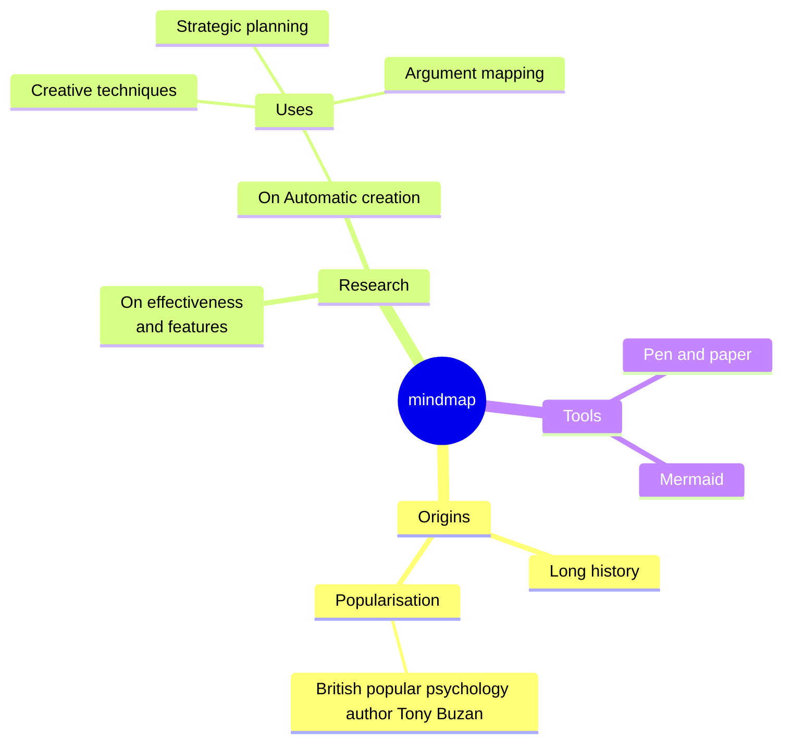

Mermaid diagrams are included in your Markdown using the following syntax:

````

````

Though only 1 example is show above, several are included below to test out Mermaid's various diagram types and features.

Markweb uses the default "dark" theme.

See the [Mermaid documentation](https://mermaid.ai/open-source/intro/) for more details on the syntax and features available.

Mermaid diagram rendering is the exception to the Markweb rule of rendering on the Server rather than in the client browser.
This is because Mermaid uses various browser APIs not available in the Node.js environment.
If you see the raw text instead of the diagram, check the browser console for errors related to Mermaid rendering.
It is likely that the pre-built Mermaid library is not being loaded correctly, or that you have an error in your Mermaid syntax.

---






