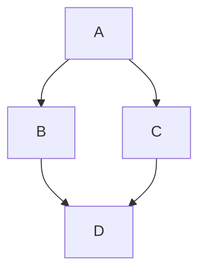

If the mermaid extension is enabled, you can include Mermaid diagrams in your markdown files using the following syntax:

````

```mermaid
graph TD;
    A-->B;
    A-->C;
    B-->D;
    C-->D;
```
````


```mermaid
graph TD;
    A-->B;
    A-->C;
    B-->D;
    C-->D;
```
